  
In this series of blog posts, I will compare different machine and deep learning methods to predict clothing categories from images using the Fashion MNIST data. In this first blog of the series, we will explore and prepare the data for analysis. I will also show you how to predict the clothing categories of the Fashion MNIST data using my go-to model: an artificial neural network. To show you how to use one of RStudios incredible features to run Python from RStudio, I build my neural network in Python using the code in [this Python script](https://github.com/fverkroost/RStudio-Blogs/blob/master/simple_neural_network_fashion_mnist.py) or [this Jupyter notebook](https://github.com/fverkroost/RStudio-Blogs/blob/master/simple_neural_network_fashion_mnist.ipynb) on my Github. In the [second blog post](https://github.com/fverkroost/RStudio-Blogs/blob/master/machine_learning_fashion_mnist_post2.Rmd), we will experiment with tree-based methods (single tree, random forests and boosting) and support vector machines to see whether we can beat the neural network in terms of performance. As Python cannot be run in this blog post, I will walk you through the results from this script produced earlier, but if you would also like to see how to embed Python code and results in R Markdown files, check out [this Markdown file on my Github](https://github.com/fverkroost/RStudio-Blogs/blob/master/machine_learning_fashion_mnist_post1_embedded.Rmd)! The R code used for this blog is also included on my [Github](https://github.com/fverkroost/RStudio-Blogs/blob/master/machine_learning_fashion_mnist_post1.R).

```{r setup, message = FALSE, warning = FALSE, results = 'hide', echo = FALSE}
knitr::opts_chunk$set(echo = TRUE)
```

To start, we first set our seed to make sure the results are reproducible.
```{r, message = FALSE, warning = FALSE, results = 'hide'}
set.seed(1234)
```

## Importing and exploring the data

The `keras` package contains the Fashion MNIST data, so we can easily import the data into RStudio from this package directly after installing it from Github and loading it.

```{r, message = FALSE, warning = FALSE, results = 'hide'}
library(devtools)
devtools::install_github("rstudio/keras")
library(keras)        
install_keras()  
fashion_mnist <- keras::dataset_fashion_mnist()
```

The resulting object named `fashion_mnist` is a nested list, consisting of lists `train` and `test`. Each of these lists in turn consists of arrays `x` and `y`. To look at the dimentions of these elements, we recursively apply the `dim()` function to the `fashion_mnist` list.

```{r}
rapply(fashion_mnist, dim)
```

From the result, we observe that the `x` array in the training data contains `r dim(fashion_mnist$train$x)[3]` matrices each of `r nrow(fashion_mnist$train$x)` rows and `r ncol(fashion_mnist$train$x)` columns, or in other words `r nrow(fashion_mnist$train$x)` images each of `r ncol(fashion_mnist$train$x)` by `r dim(fashion_mnist$train$x)[3]` pixels. The `y` array in the training data contains `r nrow(fashion_mnist$train$y)` labels for each of the images in the `x` array of the training data. The test data has a similar structure but only contains `r nrow(fashion_mnist$test$x)` images rather than `r nrow(fashion_mnist$train$x)`. For simplicity, we rename these lists elements to something more intuitive (where `x` now represents images and `y` represents labels):
  
```{r}
c(train.images, train.labels) %<-% fashion_mnist$train
c(test.images, test.labels) %<-% fashion_mnist$test
```

Every image is captured by a `r ncol(fashion_mnist$train$x)` by `r dim(fashion_mnist$train$x)[3]` matrix, where entry [i, j] represents the opacity of that pixel on an integer scale from `r min(fashion_mnist$train$x)` (white) to `r max(fashion_mnist$train$x)` (black). The labels consist of integers between zero and nine, each representing a unique clothing category. As the category names are not contained in the data itself, we have to store and add them manually. Note that the categories are evenly distributed in the data.

```{r}
cloth_cats = data.frame(category = c('Top', 'Trouser', 'Pullover', 'Dress', 'Coat',  
                                     'Sandal', 'Shirt', 'Sneaker', 'Bag', 'Boot'), 
                        label = seq(0, 9))
```

To get an idea of what the data entail and look like, we plot the first ten images of the test data. To do so, we first need to reshape the data slightly such that it becomes compatible with `ggplot2`. We select the first ten test images, convert them to data frames, rename the columns into digits 1 to `r ncol(fashion_mnist$train$x)`, create a variable named `y` with digits 1 to `r ncol(fashion_mnist$train$x)` and then we melt by variable `y`. We need package `reshape2` to access the `melt()` function. This results in a `r ncol(fashion_mnist$train$x)` times `r ncol(fashion_mnist$train$x)` equals `r ncol(fashion_mnist$train$x)*ncol(fashion_mnist$train$x)` by 3 (y pixels (= y), x pixels (= variable) and the opacity (= value)) data frame. We bind these all together by rows using the `rbind.fill()` function from the `plyr` package and add a variable `Image`, which is a unique string repeated `r ncol(fashion_mnist$train$x)*ncol(fashion_mnist$train$x)` times for each of the nine images containing the image number and corresponding test set label.

```{r, message = FALSE, warning = FALSE, results = 'hide'}
library(reshape2)
library(plyr)
subarray <- apply(test.images[1:10, , ], 1, as.data.frame)
subarray <- lapply(subarray, function(df){
  colnames(df) <- seq_len(ncol(df))
  df['y'] <- seq_len(nrow(df))
  df <- melt(df, id = 'y')
  return(df)
})
plotdf <- rbind.fill(subarray)
first_ten_labels <- cloth_cats$category[match(test.labels[1:10], cloth_cats$label)]
first_ten_categories <- paste0('Image ', 1:10, ': ', first_ten_labels)
plotdf['Image'] <- factor(rep(first_ten_categories, unlist(lapply(subarray, nrow))), 
                          levels = unique(first_ten_categories))
```

We then plot these first ten test images using package `ggplot2`. Note that we reverse the scale of the y-axis because the original dataset contains the images upside-down. We further remove the legend and axis labels and change the tick labels.

```{r, message = FALSE, warning = FALSE, results = 'hide'}
library(ggplot2)
```

```{r}
ggplot() + 
  geom_raster(data = plotdf, aes(x = variable, y = y, fill = value)) + 
  facet_wrap(~ Image, nrow = 2, ncol = 5) + 
  scale_fill_gradient(low = "white", high = "black", na.value = NA) + 
  theme(aspect.ratio = 1, legend.position = "none") + 
  labs(x = NULL, y = NULL) + 
  scale_x_discrete(breaks = seq(0, 28, 7), expand = c(0, 0)) + 
  scale_y_reverse(breaks = seq(0, 28, 7), expand = c(0, 0))
```

## Data Preparation

Next, it's time to start the more technical work of predicting the labels from the image data. First, we need to reshape our data to convert it from a multidimensional array into a two-dimensional matrix. To do so, we vectorize each `r ncol(fashion_mnist$train$x)` by `r ncol(fashion_mnist$train$x)` matrix into a column of length `r ncol(fashion_mnist$train$x)*ncol(fashion_mnist$train$x)`, and then we bind the columns for all images on top of each other, finally taking the transpose of the resulting matrix. This way, we can convert a `r ncol(fashion_mnist$train$x)` by `r ncol(fashion_mnist$train$x)` by `r nrow(fashion_mnist$train$x)` array into a `r nrow(fashion_mnist$train$x)` by `r ncol(fashion_mnist$train$x)*ncol(fashion_mnist$train$x)` matrix. We also normalize the data by dividing between the maximum opacity of `r max(fashion_mnist$train$x)`.

```{r}
train.images <- data.frame(t(apply(train.images, 1, c))) / max(fashion_mnist$train$x)
test.images <- data.frame(t(apply(test.images, 1, c))) / max(fashion_mnist$train$x)
```

We also create two data frames that include all training and test data (images and labels), respectively.

```{r}
pixs <- 1:ncol(fashion_mnist$train$x)^2
names(train.images) <- names(test.images) <- paste0('pixel', pixs)
train.labels <- data.frame(label = factor(train.labels))
test.labels <- data.frame(label = factor(test.labels))
train.data <- cbind(train.labels, train.images)
test.data <- cbind(test.labels, test.images)
```

## Artificial Neural Network

Now, let's continue by building a simple neural network model to predict our clothing categories. Neural networks are artificial computing systems that were built with human neural networks in mind. Neural networks contain nodes, which transmit signals amongst one another. Usually the input at each node is a number, which is transformed according to a non-linear function of the input and weights, the latter being the parameters that are tuned while training the model. Sets of neurons are collected in different layers; neural networks are reffered to as 'deep' when they contain at least two hidden layers. If you're not familiar with artificial neural networks, then [this free online book](http://neuralnetworksanddeeplearning.com/index.html) is a good source to start learning about them.

In this post, I will show you how artificial neural networks with different numbers of hidden layers compare, and I will also compare these networks to a convolutional network, which often performs better in the case of visual imagery. I will show you some basic models and how to code these, but will not spend too much time on tuning neural networks, for example when it comes to choosing the right amount of hidden layers or the number of nodes in each hidden layer. In essence, what it comes down to is that these parameters largely depend on your data structure, magnitude and complexity. The more hidden layers one adds, the more complex non-linear relationships can be modelled. Often, in my experience, adding hidden layers to a neural network increases their performance up to a certain number of layers, after which the increase becomes non-significant while the computational requirements and interpretation become more infeasible. It is up to you to play around a bit with your specific data and test how this trade-off works. 

Although neural networks can easily built in RStudio using Tensorflow and Keras, I really want to show you one of the incredible features of RStudio where you can run Python in RStudio. This can be done in two ways: either we choose "Terminal" on the top of the output console in RStudio and run Python via Terminal, or we use the base `system2()` function to run Python in RStudio. 

For the second option, to use the `system2()` command, it's important to first check what version of Python should be used. You can check which versions of Python are installed on your machine by running `python --version` in Terminal. Note that with RStudio 1.1 (1.1.383 or higher), you can run in Terminal directly from RStudio on the "Terminal" tab. You can also run `python3 --version` to check if you have Python version 3 installed. On my machine, `python --version` and `python3 --version` return Python 2.7.16 and Python 3.7.0, respectively. You can then run `which python` (or `which python3` if you have Python version 3 installed) in Terminal, which will return the path where Python is installed. In my case, these respective commands return `/usr/bin/python` and `/Library/Frameworks/Python.framework/Versions/3.7/bin/python3`. As I will make use of Python version 3, I specify the latter as the path to Python in the `use_python()` function from the `reticulate` package. We can check whether the desired version of Python is used by using the `sys` package from Python. Just make sure to change the path in the code below to what version of Python you desire using and where that version in installed.

```{r, eval = FALSE}
library(reticulate)
use_python(python = '/Library/Frameworks/Python.framework/Versions/3.7/bin/python3')
```

```{r, eval = FALSE}
sys <- import("sys")
sys$version
```

Now that we've specified the correct version of Python to be used, we can run our Python script from RStudio using the `system2()` function. This function also takes an argument for the version of Python used, which in my case is Python version 3. If you are using an older version of Python, make sure to change `"python3"` in the command below to `"python2"`.

```{r, eval = FALSE}
python_file <- "simple_neural_network_fashion_mnist.py"
system2("python3", args = c(python_file), stdout = NULL, stderr = "")
```

The source code used to build and fit the neural networks from the above script can be found in [this Python script](https://github.com/fverkroost/RStudio-Blogs/blob/master/simple_neural_network_fashion_mnist.py) or [this Jupyter notebook](https://github.com/fverkroost/RStudio-Blogs/blob/master/simple_neural_network_fashion_mnist.ipynb) on my Github.. In this post, I will walk you through the results from this script produced earlier, but if you would also like to see how to embed Python code and results in R Markdown files, check out [this file on my Github](https://github.com/fverkroost/RStudio-Blogs/blob/master/machine_learning_fashion_mnist_post1_embedded.Rmd)!


I will now guide you step by step through the script called in the command above. First, we load the required packages in Python and set the session seed for replicability.

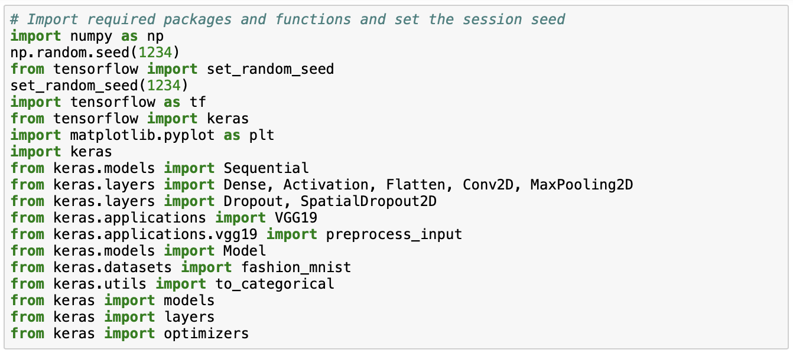

We then load the fashion MNIST data from `keras` and we normalize the data by dividing by maximum opacity of 255.

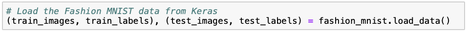


We start by building a simple neural network containing one hidden layer. Note that as here we use the untransformed but normalized data, we need to flatten the `r ncol(fashion_mnist$train$x)` by `r ncol(fashion_mnist$train$x)` pixels input first. We add one hidden densely-connected layer which performs `output = relu(dot(input, kernel) + bias)`, where the rectified linear unit (`relu`) activation function has been proven to work well. We set the number of nodes equal to 128, because this seems to work well in our case. The number of nodes could essentially be any of the numbers 32, 64, 128, 256 and 512, as these are in a sequence of multiples between the number of nodes in the output (= 10) and input (= 784) layers. The `softmax` layer then assigns predicted probabilities to each of the ten clothing categories, which is also why there are ten nodes in this layer.

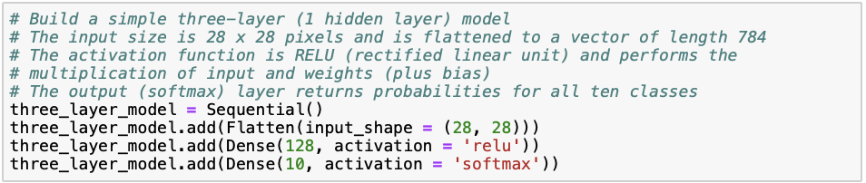

After building the neural network, we compile it. We specify `sparse_categorical_crossentropy` as the loss function, which is suitable for categorical multi-class responses. The optimizer controls the learning rate; `adam` (adaptive moment estimation) is similar to classical stochastic gradient descent and usually a safe choice for the optimizer. We set our metric of interest to be the accuracy, or the percentage of correctly classified images. Hereafter, we fit the model onto our training data set using ten iterations through the training data ("epochs"). Here, 70% is used for training and 30% is used for validation.

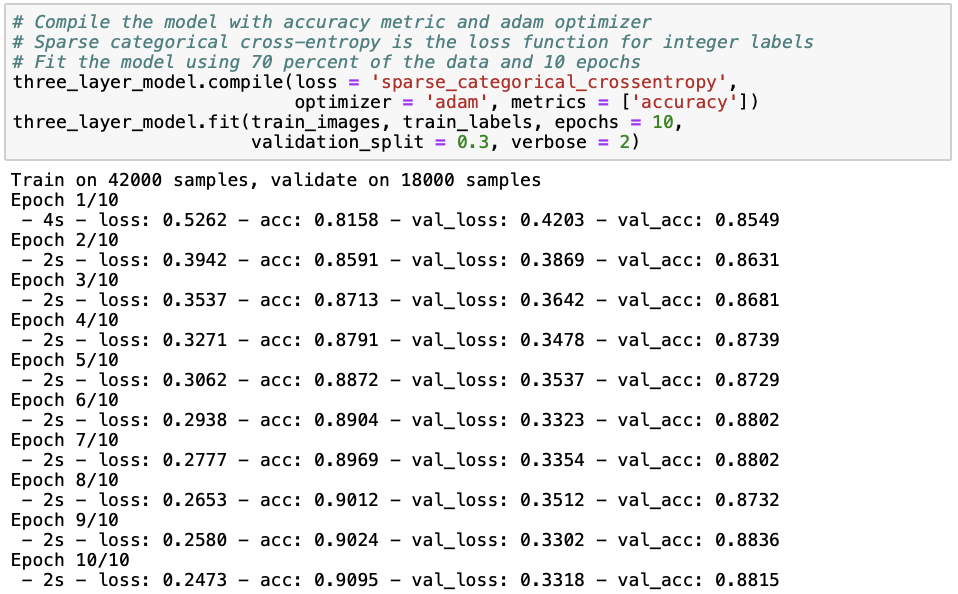

Next, we print the results of the model in terms of training and testing loss and accuracy.

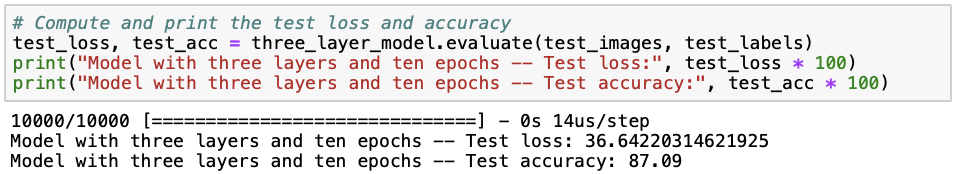

We can see that the neural network with one hidden layer already performs relatively well with a test accuracy of 87.09%. However, it seems like we are slightly overfitting (i.e. the model is fitted too well to a particular data set and therefore does not well extend to other data sets), as the training set accuracy (88.15%) is slightly higher than the test set accuracy. There are several ways to avoid overfitting in neural networks, such as simplifying our model by reducing the number of hidden layers and neurons, adding dropout layers that randomly remove some pof the connections between layers, and early stopping when validation loss starts to increase. Later on in this post, I will demonstrate some of these methods to you. For further reading, I personally like [this](https://towardsdatascience.com/dont-overfit-how-to-prevent-overfitting-in-your-deep-learning-models-63274e552323) and [this](https://keras.rstudio.com/articles/tutorial_overfit_underfit.html) post showing how to avoid overfitting when building neural networks using `keras`. Instead, to see whether a deep neural network performs better at predicting clothing categories, we build a neural network with three hidden layers in a similar way as before.

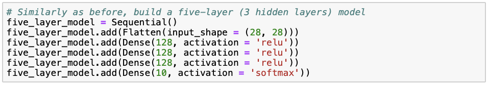
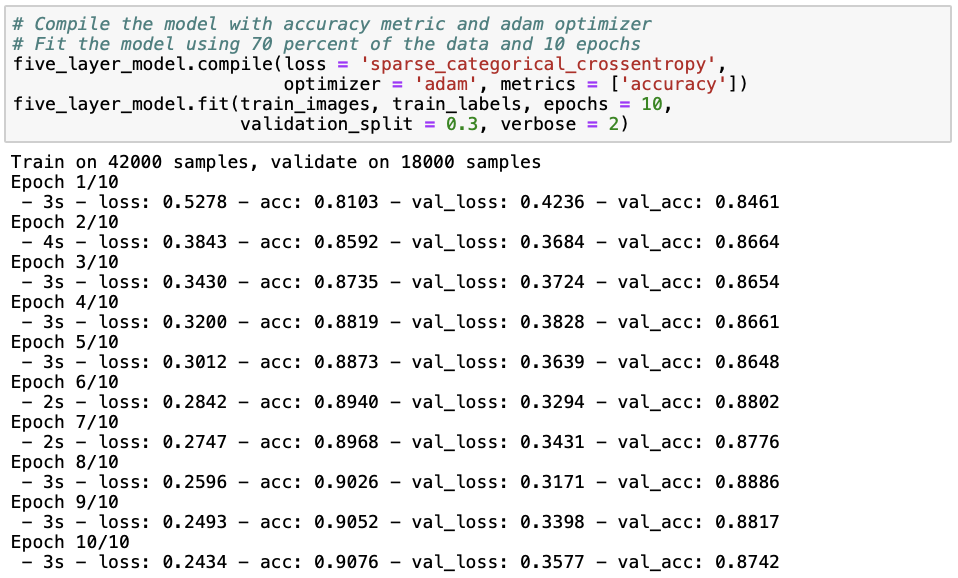


It seems like the model with two additional layers does not perform better than the previous one with only one hidden layer, given that both the training (87.42%) and test set (86.03%) accuracies are lower and the loss (38.49) is higher. Let's try whether adding another five hidden layers improves model performance, or whether we can include that increasing model complexity does not improve performance.

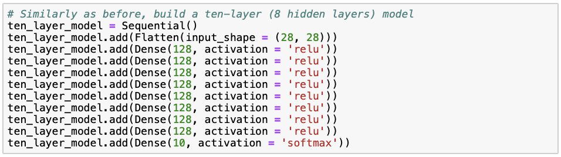
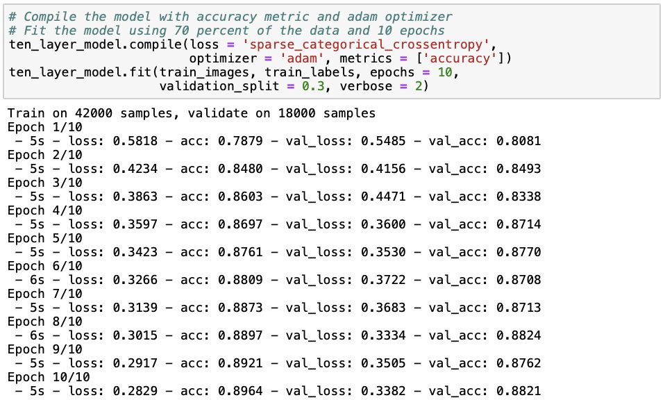
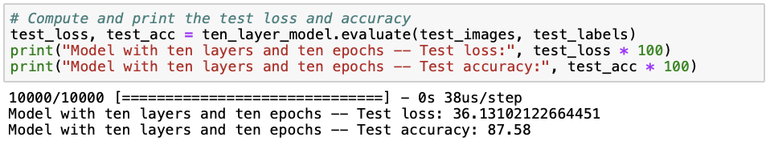

The model with eight hidden layers performs best in terms of training (88.21%) and test (87.58%) accuracy as well as loss (36.12). Nevertheless, the difference in performance between the first model with one hidden layer and the current model with eight hidden layers is only quite small. Although it seems that with so many hidden layers, we can model additional complexity that improves the accuracy of the model, we must ask ourselves whether increasing model complexity at the cost of interpretability and computational feasibility is worth this slight improvement in accuracy and loss. 

Now that we have seen how the number of hidden layers affects model performance, let's try and see whether increasing the number of epochs (i.e. the number of times the model iterates through the training data) from ten to fifty improves the performance of our first neural network with one hidden layer. 

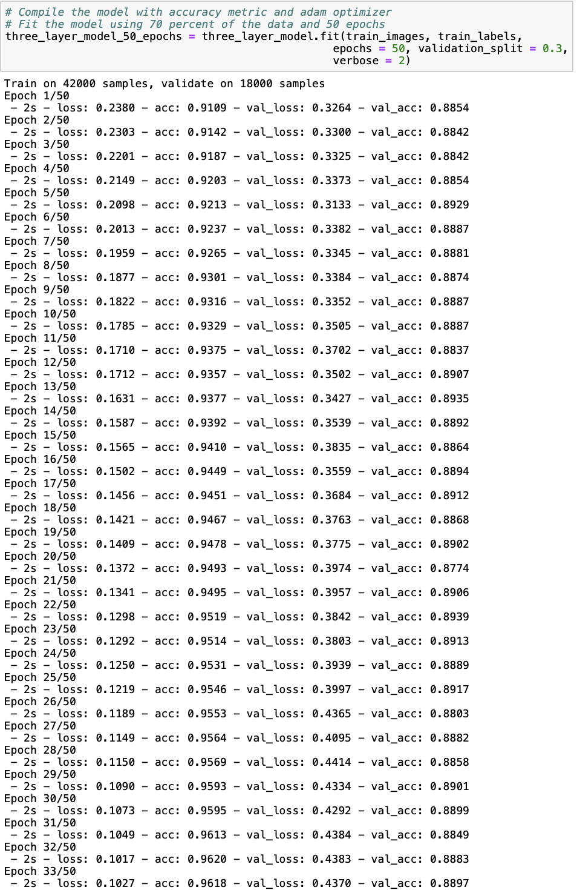
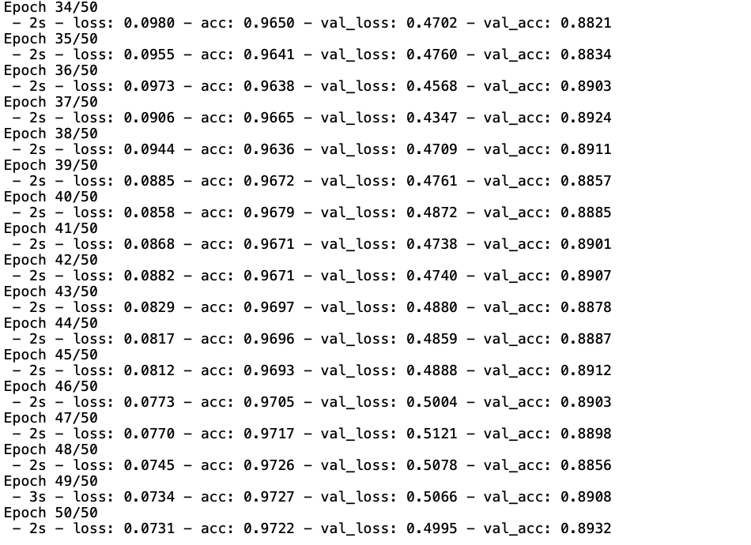
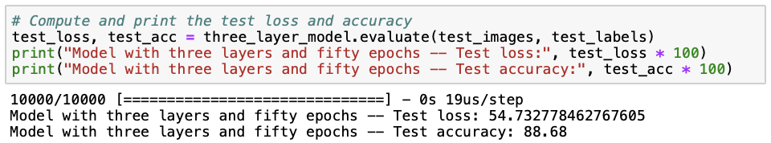

The three-layer model trained with fifty epochs has the highest train (89.32%) and test (88.68%) accuracies we have seen so far. However, the loss (54.73) is also about a third larger than we have seen before. Additionally, the model is also less time-efficient, given that the increase in accuracy is not substantial but the model takes significantly longer to fit. To better understand the trade-off between minimizing loss and maximizing accuracy, we plot model loss and accuracy over the number of epochs for the training and cross-validation data.

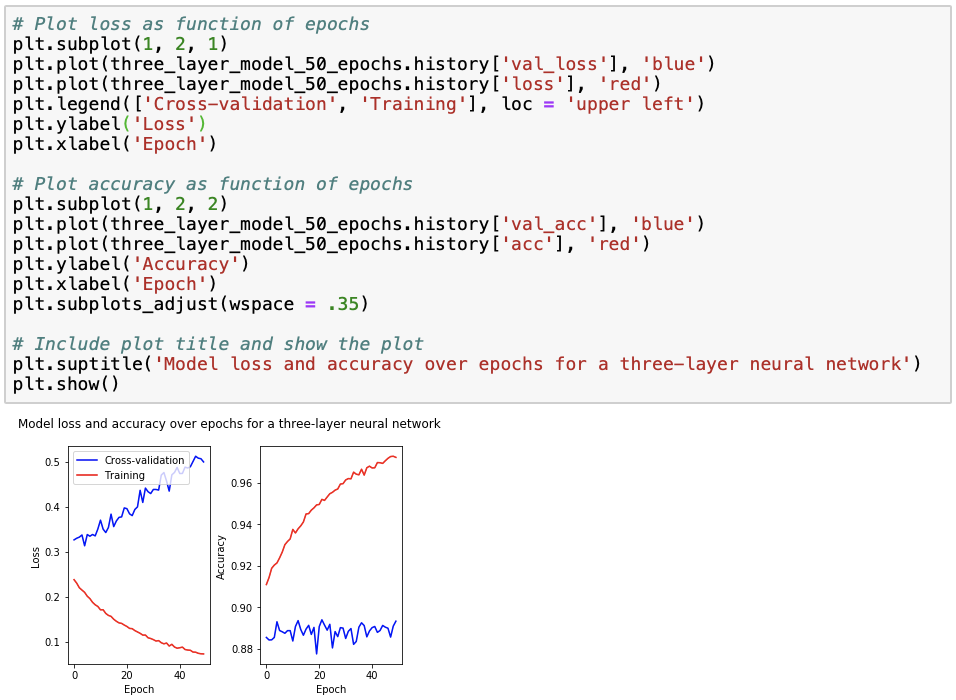

We observe that for the training data, loss decreases to zero while accuracy increases to one, as a result of overfitting. This is why we also check how the model performs on the cross-validation data, for which we observe that loss increases with the number of epochs while accuracy remains relatively stable. Using this figure, we can select an "optimal" number of epochs such that accuracy is maximized while loss is minimized. Looking at the cross-validation data accuracy, we see that the accuracy peak lays at around 20 epochs, for which loss is approximately 0.4. However, similar accuracies but much lower losses and modelling time are achieved with around 6 and 12 epochs, and so we might rather choose to train our model with around 6 or 20 epochs.

Regarding the model output, the predictions returned are probabilities per class or clothing category. We can calculate the majority vote by taking class that has the maximum of predicted probabilities of all classes. We can print the first ten elements of the `majority_vote` dictionary, which we can obtain as follows:

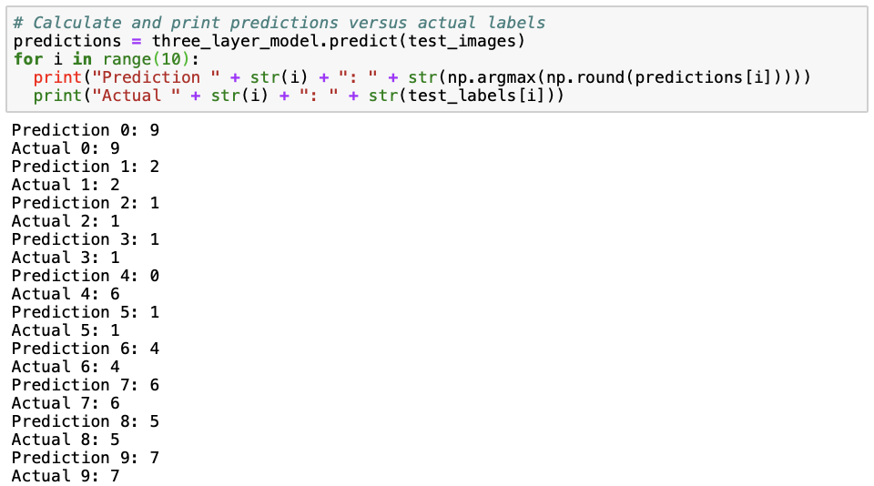

All except the fifth (number 4) prediction are correct. In the fifth prediction, a shirt (category 6) is being misclassified as a top (category 0).

## Convolutional Neural Network

I also wanted to show you how to build a convolutional neural network and compare its performance to the neural networks presented earlier, mostly because convolutional neural networks have generally been shown to perform better on visual image data. Essentially, what happens in a convolutional neural network is that a smaller matrix (the "filter matrix" or "kernel") slides over the full image matrix, moving pixel by pixel, multiplies the filter matrix with the part of the full image matrix covered by the filter matrix on that moment, sums up these values and then repeats this until the full image matrix has been covered. For a more extensive explanation on how convolutional neural networks, I refer you to [this page](https://towardsdatascience.com/a-comprehensive-guide-to-convolutional-neural-networks-the-eli5-way-3bd2b1164a53) or [this page](https://medium.com/@RaghavPrabhu/understanding-of-convolutional-neural-network-cnn-deep-learning-99760835f148).

As we need to prepare our data slightly differently for a convolutional neural network, we reload the data and reshape the images to "flatten" them. The last "1" in the reshape dimensions stand for a greyscale, as we have images on a black-to-white scale. If we would have RGB images, we would change the "1" into a "3". 

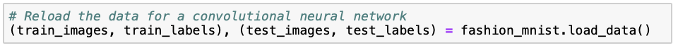

We make sure the the values of the pixels, ranging from zero to 255, are of the float type and then we normalize the values as before.

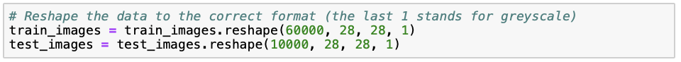
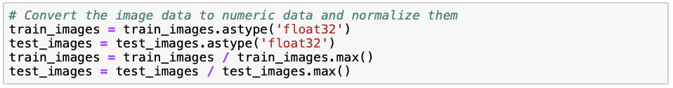

The convolutional neural network cannot deal with categorical labels. Therefore, we transform the labels to binary vectors, where all vectors have length ten (as there are ten categories), a "1" at the index of the category and zeros elsewhere. For example, category 3 and 8 would be coded as [0, 0, 0, 1, 0, 0, 0, 0, 0, 0] and [0, 0, 0, 0, 0, 0, 0, 0, 1, 0], respectively. This transformation is referred to as "one hot encoding".

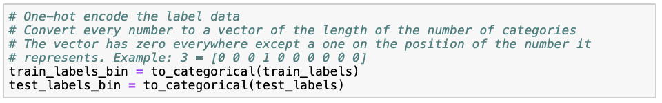

Now, we can start building our convolutional neural network. The first layer `Conv2D` is a convolutional layer that takes a 2-dimensional matrix of 28 by 28 pixels in greyscale (1) as input. As before, we use 128 nodes in this layer, as the size of the data is not extremely large and we want to avoid making our model unnecessarily complex. The filter matrix is of size 3 by 3, which is quite standard. As before, we use the rectified linear ("relu") activation function. The `MaxPooling2D` layer reduces the dimensionality (and thus required computational power) by outputting the maximum of the part of the input image that is captured by the filter matrix. The `Flatten` layer simply flattens the result from the previous layer into a vector. As we saw before, The `softmax` layer then assigns predicted probabilities to each of the ten clothing categories. Note that we use the same optimizer and metric as before, but that we now use "categorical_crossentropy" as the loss function instead of "sparse_categorical_crossentropy". The reason for this is that the former works for one-hot encoded labels, whereas the other works for categorical labels.  

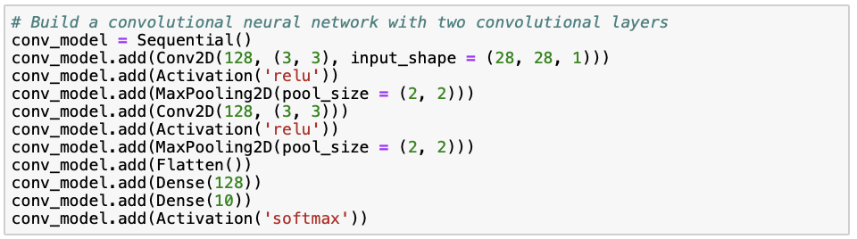

We fit our model to the training data, where we set the `batch_size` argument equal to the number of neurons in the convolutional layers (= 128).

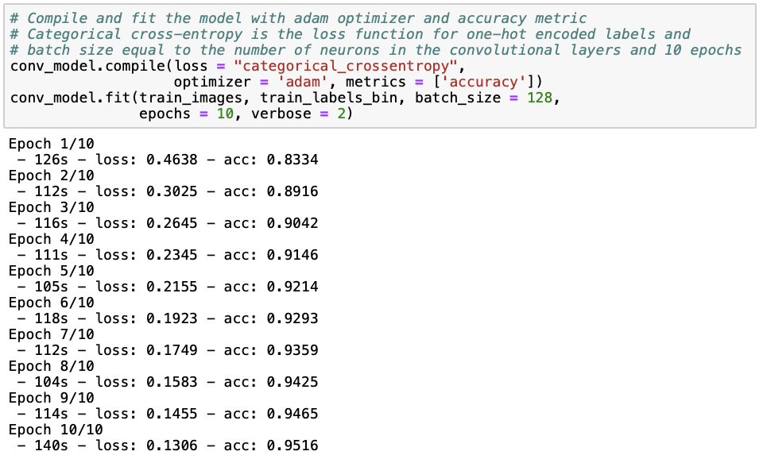

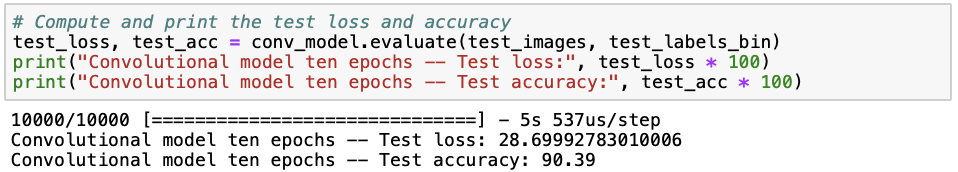

Although we are still overfitting, we observe that the convolutional neural network performs better than the neural networks we saw earlier, achieving a training set accuracy of 95.16% and a test set accuracy of 90.39%, and a lower loss of 28.70. This was to be expected, because convolutional neural networks have previously been shown to perform well on visual imagery data. Let's see if we can reduce overfitting by reducing the number of neurons from 128 to 64, adding dropout layers and enabling early stopping. Note that the rate in the `Dropout` layer is the percentage of connections between layers that are being removed. the `SpatialDropout2D` is a special kind of dropout layer for convolutional neural networks, which drops certain multiplications of the filter matrix with parts of the original image before pooling across all movements over the original image. 

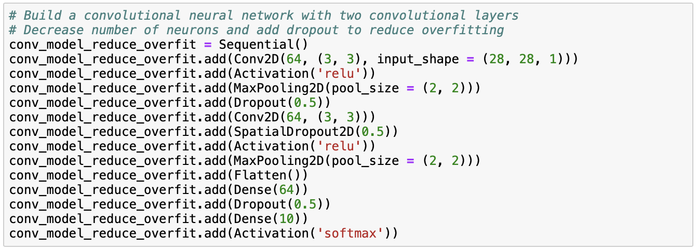

When fitting our model, we also enable early stopping to reduce overfitting. Instead of going through all epochs specified, early stopping automatically stops the iterations through the epoch once it's being noticed that the validation loss increases.

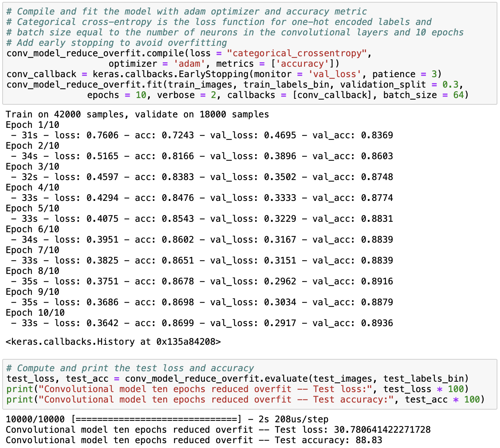

From the results, we observe that although the training and test accuracies have decreased, they are now much more similar than before. The test accuracy has not decreased substantially, but the training accuracy has, which means that overfitting is much less of a problem than before. Next, we can print the first ten predictions from the model and the first ten actual labels and compare them.

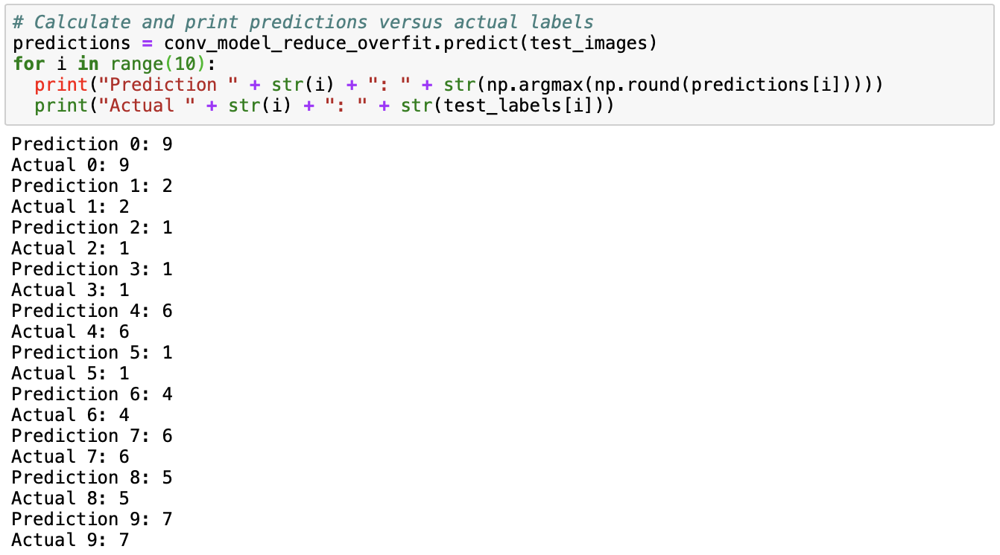

Comparing these predictions to the first ten labels in the data set, we observe that the first ten predictions are correct!

## Next up...

Next up in this series of blog posts, I will experiment with tree-based methods and support vector machines to see if they perform as well as the neural network in predicting clothing categories in the Fashion MNIST data. [Let's go!](https://github.com/fverkroost/RStudio-Blogs/blob/master/machine_learning_fashion_mnist_post2.Rmd)


