In this series of blog posts, I will compare different machine and deep learning methods to predict clothing categories from images using the Fashion MNIST data by Zalando. In [the first blog post of this series](https://rviews.rstudio.com/2019/11/11/a-comparison-of-methods-for-predicting-clothing-classes-using-the-fashion-mnist-dataset-in-rstudio-and-python-part-1/), we explored and prepared the data for analysis and learned how to predict the clothing categories of the Fashion MNIST data using my go-to model: an artificial neural network. In this second blog post, we will experiment with tree-based methods (single tree, random forests and boosting) and support vector machines to see whether we can beat the neural network in terms of performance, which was 88.8% on the test data. The R code for this post can be found on my [Github](https://github.com/fverkroost/RStudio-Blogs/blob/master/machine_learning_fashion_mnist_post2.R).

```{r setup, message = FALSE, warning = FALSE, results = 'hide', echo = FALSE}
knitr::opts_chunk$set(echo = TRUE)
```

# Data Preparation

In the [first blog post of this series](https://rviews.rstudio.com/2019/11/11/a-comparison-of-methods-for-predicting-clothing-classes-using-the-fashion-mnist-dataset-in-rstudio-and-python-part-1/), I already showed you how to load the data, plot some of the images in the data and prepare them for further analysis. Therefore, I won't do that here again in detail, but please read the post for a more extensive explanation of what the data look like. The `keras` package contains the Fashion MNIST data, so we can easily import the data into RStudio from this package directly after installing it from Github and loading it. 

```{r, message = FALSE, warning = FALSE, results = 'hide'}
library(devtools)
devtools::install_github("rstudio/keras")
library(keras)        
install_keras()  
fashion_mnist = keras::dataset_fashion_mnist()
```

We obtain separate data sets for the training and test images as well as the training and test labels.

```{r, message = FALSE, warning = FALSE, results = 'hide'}
library(magrittr)
c(train.images, train.labels) %<-% fashion_mnist$train
c(test.images, test.labels) %<-% fashion_mnist$test
```

Next, we normalize the image data by dividing the pixel values by the maximum value of 255.

```{r, message = FALSE, warning = FALSE, results = 'hide'}
train.images = data.frame(t(apply(train.images, 1, c))) / max(fashion_mnist$train$x)
test.images = data.frame(t(apply(test.images, 1, c))) / max(fashion_mnist$train$x)
```

We then combine the training images `train.images` and labels `train.labels` and test images `test.images` and labels `test.labels` in separate data sets, `train.data` and `test.data`, respectively. 

```{r, message = FALSE, warning = FALSE, results = 'hide'}
pixs = ncol(fashion_mnist$train$x)
names(train.images) = names(test.images) = paste0('pixel', 1:(pixs^2))
train.labels = data.frame(label = factor(train.labels))
test.labels = data.frame(label = factor(test.labels))
train.data = cbind(train.labels, train.images)
test.data = cbind(test.labels, test.images)
```

As `train.labels` and `test.labels` contain integer values for the clothing category (i.e. 0, 1, 2, etc.), we also create objects `train.classes` and `test.classes` that contain factor labels (i.e. Top, Trouser, Pullover etc.) for the clothing categories.

```{r, message = FALSE, warning = FALSE, results = 'hide'}
cloth_cats = c('Top', 'Trouser', 'Pullover', 'Dress', 'Coat',  
                'Sandal', 'Shirt', 'Sneaker', 'Bag', 'Boot')
train.classes = factor(cloth_cats[as.numeric(as.character(train.labels$label)) + 1])
test.classes = factor(cloth_cats[as.numeric(as.character(test.labels$label)) + 1])
```

# Principal Components Analysis

Our training and test image data sets currently contain 784 pixels and thus variables. We may expect a large share of these pixels, especially those towards the boundaries of the images, to have relatively small variance, because most of the fashion items are centered in the images. To check whether this is the case, let's plot the average pixel value on a 28 by 28 grid. We first obtain the average pixel values and store these in `train.images.ave`, after which we plot these values on the grid. We also define a custom plotting theme, `my_theme`, to make sure all our figures have the same custom-defined aesthetics. Note that in the plot created, a higher cell (pixel) value means that the average value of that pixel is higher, and thus that the pixel is darker on average (as a pixel value of 0 refers to white and a pixel value of 255 refers to black).

```{r, message = FALSE, warning = FALSE}
train.images.ave = data.frame(pixel = apply(train.images, 2, mean), 
                               x = rep(1:pixs, each = pixs), 
                               y = rep(1:pixs, pixs))
library(ggplot2)
my_theme = function () { 
  theme_bw() + 
    theme(axis.text = element_text(size = 14),
          axis.title = element_text(size = 14),
          strip.text = element_text(size = 14),
          panel.grid.major = element_blank(), 
          panel.grid.minor = element_blank(),
          panel.background = element_blank(), 
          legend.position = "bottom",
          strip.background = element_rect(fill = 'white', colour = 'white'))
}
ggplot() +
  geom_raster(data = train.images.ave, aes(x = x, y = y, fill = pixel)) +
  my_theme() +
  labs(x = NULL, y = NULL, fill = "Average scaled pixel value") +
  ggtitle('Average image in Fashion MNIST training data')
```

As we can see from the plot, there are quite some pixels with a low average value, meaning that they are white in most of the images in our training data. Let's have a look at how many variables can explain which part of the variance in our data. We first compute the 784 by 784 covariance matrix of our training images using the `cov()` function, after which we execute principal components analysis (PCA) on the covariance matrix using the `prcomp()` function in the `stats` library. Essentially, PCA statistically reduces the dimensions of a set of correlated variables by transforming them into a smaller number of linearly uncorrelated variables (principal components) that are linear combinations of the original variables. The first principal component explains the largest part of the variance, followed by the second principal component andsoforth. For a more extensive explanation of PCA, I refer you to James et al. (2013). Looking at the result of PCA, we observe that 50 principal components in our data explain 99.902% of the variance in the data. This can be nicely shown in a plot of the cumulative proportion of variance against component indices. Note that the component indices here are sorted by their ability to explain the variance in our data, and not based on their pixel position in the 28 by 28 image.

```{r, message = FALSE, warning = FALSE}
library(stats)
cov.train = cov(train.images)                      
pca.train = prcomp(cov.train)                  

plotdf = data.frame(index = 1:(pixs^2), 
                    cumvar = summary(pca.train)$importance["Cumulative Proportion", ])
t(head(plotdf, 50)) 

ggplot() + 
  geom_point(data = plotdf, aes(x = index, y = cumvar), color = "red") +
  labs(x = "Index of primary component", y = "Cumulative proportion of variance") +
  my_theme() +
  theme(strip.background = element_rect(fill = 'white', colour = 'black'))
```

We observed that 99.5% of the variance is explained by only 17 principal components. As 99.5% is already a large share of the variance, and we want to reduce the number of pixels (variables) by as many as we can to reduce computation time for the models coming up, we choose to select the 17 components explaining 99.5% of the variance. Although this is unlikely to influence our results hugely, if you have more time, I'd suggest you select the 50 components explaining 99.9% of the data, or execute the analyses on the full data set. We also save the relevant part of the rotation matrix created by the `prcomp()` function and stored in `pca.train`, such that its dimensions become 784 by 17, and then we multiply our training and test image data by this rotation matrix called `pca.rot`. We then combine the transformed image data (`train.images.pca` and `test.images.pca`) with the integer labels for the clothing categories in `train.data.pca` and `test.data.pca`. We will use these reduced data in our further analyses to decrease computational time.

```{r, message = FALSE, warning = FALSE}
pca.dims = which(plotdf$cumvar >= .995)[1]
pca.rot = pca.train$rotation[, 1:pca.dims]  

train.images.pca = data.frame(as.matrix(train.images) %*% pca.rot)
test.images.pca  = data.frame(as.matrix(test.images) %*% pca.rot)

train.data.pca = cbind(train.images.pca, label = factor(train.data$label))
test.data.pca = cbind(test.images.pca, label = factor(test.data$label))
```

# Model Performance

To easily compare the models we estimate in this blog post, let's write a simple function `model_performance()` that is able to output some performance metrics for each type of model we will estimate (single tree, random forest, gradient-boosted trees, support vector machines). The function essentially predicts the estimated model on both the training data and test data, resulting in `pred_train` respectively `pred_test`, and then computes the accuracy, precision, recall and F1 measures for both the training and test set predictions. Have a look at [this blog post](https://towardsdatascience.com/whats-the-deal-with-accuracy-precision-recall-and-f1-f5d8b4db1021) if you are unsure what these performance metrics entail. Depending on the type of model, sometimes inputs `testX` and `testY` require the categorical classes (e.g. top, trouser, pullover etcetera) as in `train.classes` and `test.classes`, whereas other models estimate like the random forests estimate the integer classes (e.g. 0, 1, 2 etcetera) and thus require classes as in `train.data$label` and `test.data$label`. Note that for a single tree of class `rpart`, we need to add `type = "class"` to make sure classes rather than class probabilities are returned, and that for the other models implemented with the `caret` package, we need to use the out-of-bag predictions contained in the model objects (`fit$pred`) rather than the manually computed in-sample (non-out-of-bag) predictions for the training data. As `fit$pred` contains the predictions for all tuning parameter values specified by the user while we only need those predictions belonging to the optimal tuning parameter values, we subset `fit$pred` to only contain those predictions and observations in indices `rows`. Note that we convert `fit$pred` to a `data.table` object to find these indices as computations on `data.table` objects are much faster for large data frames as in our case (e.g. `xgb_tune$pred` has over 29 million rows as we will see later on).

```{r}
model_performance = function(fit, trainX, testX, trainY, testY, model_name){
  
  # Predictions on train and test data for different types of models
  if (any(class(fit) == "rpart")){
    
    library(rpart)
    pred_train = predict(fit, newdata = trainX, type = "class")
    pred_test = predict(fit, newdata = testX, type = "class")
    
  } else if (any(class(fit) == "train")){
    
    library(data.table)
    pred_dt = as.data.table(fit$pred[, names(fit$bestTune)]) 
    names(pred_dt) = names(fit$bestTune)
    index_list = lapply(1:ncol(fit$bestTune), function(x, DT, tune_opt){
      return(which(DT[, Reduce(`&`, lapply(.SD, `==`, tune_opt[, x])), .SDcols = names(tune_opt)[x]]))
    }, pred_dt, fit$bestTune)
    rows = Reduce(intersect, index_list)
    pred_train = fit$pred$pred[rows]
    pred_test = predict(fit, newdata = testX)
    trainY = fit$pred$obs[rows]
    
  } else {
    
    print(paste0("Error: Function evaluation unknown for object of type ", class(fit)))
    break
    
  }
  
  # Performance metrics on train and test data
  library(MLmetrics)
  df = data.frame(accuracy_train = Accuracy(trainY, pred_train),
                  precision_train = Precision(trainY, pred_train),
                  recall_train = Recall(trainY, pred_train),
                  F1_train = F1_Score(trainY, pred_train), 
                  accuracy_test = Accuracy(testY, pred_test),
                  precision_test = Precision(testY, pred_test),
                  recall_test = Recall(testY, pred_test),
                  F1_test = F1_Score(testY, pred_test),
                  model = model_name)
  
  print(df)
  
  return(df)
}
```

# Tree-Based Methods

In this first sub-section, we will compare different tree-based methods: single trees, random forests and gradient-boosted trees. Tree-based methods stratify or segment the predictor space into a number of simple regions using a set of decision rules that can be summarized in a decision tree. The focus here will be on classification trees, as the Fashion MNIST outcome variable is categorical and has 10 classes. Unfortunately, single trees have a relatively low level of predictive accuracy compared to other classification approaches, such as logistic regression or discriminant analysis. To improve prediction accuracy, ensemble methods aggregate many single decision trees and thereby provide a good way to achieve prediction accuracy while decreasing variance. Here, I decided to show random forests and gradient-boosted trees as ensemble methods because the former are easier to implement as they are more robust to over-fitting and require less tuning, while the latter generally outperform other tree-based methods in terms of prediction accuracy. The models are estimated in supervised mode here as labeled data is available and the goal is to predict classes. For a more formal explanation of the tree-based methods used in this blog post, I refer you to James et al. (2013).

## Single Tree

We start by fitting a single classification tree. It is important to make sure that the *label* variable in the data are of *factor* class such that a classification tree instead of a regression tree is being fit.

```{r, warning = FALSE, error = FALSE,  message = FALSE}
library(rpart)
set.seed(1234)
tree = rpart(label ~., method = "class", data = train.data.pca)
plotcp(tree)
printcp(tree)
mp.single.tree = model_performance(tree, train.images.pca, test.images.pca, 
                                   train.data.pca$label, test.data.pca$label, "single_tree")
```

As can be seen from the plot, a higher number of tree splits results in a higher training accuracy. Nevertheless, as expected the single tree does not perform very well, with training and test set accuracies of 64.5% and 64.3% respectively. Our tree is made up of `r length(tree$variable.importance)` variables and contains `r nrow(tree$frame)` nodes and `r length(unique(tree$where))` terminal nodes. For single decision trees, the resulting tree that minimizes impurity and variance is likely to be too complex and to over-fit the training data. Tree pruning can be used to find a smaller tree with fewer splits that introduces some bias for the sake of interpretability and variance reduction. For single trees, cost-complexity pruning is usually used to improve the performance of the model. We prune the tree with the cost parameter that minimizes the error.

```{r, warning = FALSE, error = FALSE, message = FALSE}
set.seed(1234)
prune.tree = prune(tree, cp = tree$cptable[which.min(tree$cptable[, "xerror"]), "CP"])
mp.pruned.tree = model_performance(prune.tree, train.images.pca, test.images.pca, 
                                   train.data.pca$label, test.data.pca$label, "pruned_tree")
```

The pruned tree does not seem to perform better than the unpruned tree. To see what both trees look like, we plot them side by side.

```{r, warning = FALSE, error = FALSE}
par(mfrow = c(1, 2))
plot(tree, uniform = TRUE, main = "Classification Tree")
text(tree, cex = 0.5)
plot(prune.tree, uniform = TRUE, main = "Pruned Classification Tree")
text(prune.tree, cex = 0.5) 
par(mfrow = c(1, 1))
```

We observe that in this case, pruning does not change the tree nor the performance of the model.

## Random Forest

The single unpruned and pruned classification trees do not perform very well. Random forests use bootstrap aggregating to reduce the variance of the outcomes. First, bootstrapping (sampling with replacement) is used to create $B$ training sets from the population with the same size as the original training set. Second, a separate tree for each of these training sets is built. Trees are grown using recursive binary splitting on the training data until a node reaches some minimum number of observations. Hereby, the tree should go from impure (equal mixing of classes) to pure (each leaf corresponds to one class exactly). The splits are determined such that they decrease variance, error and impurity. Random forests decorrelate the trees by considering only $m$ of all $p$ predictors as split candidates, whereby often $m = \sqrt{p}$. Classification trees predict that each observation belongs to the most commonly occurring class (i.e. majority vote) of training observations in the region to which it belongs. The classification error rate is the fraction of the number of misclassified observations and the total number of classified observations. The Gini index and cross-entropy measures determine the level of impurity in order to determine the best split at each node. Third, the average of the classification prediction results of all $B$ trees is computed from the majority vote, i.e. the prediction that occurs most often among the $B$ predictions. The accuracy is computed as the out-of-bag (OOB) error and/or the test set error. As each bootstrap samples from the training set with replacement, about $\frac{2}{3}$ of the observations are not sampled and some are sampled multiple times. In the case of $B$ trees in the forest, each observation is left out of approximately $\frac{B}{3}$ trees. The non-sampled observations are used as test set and the $\frac{B}{3}$ trees are used for out-of-sample predictions. In random forests, pruning is not needed as potential over-fitting is (partially) mitigated by the usage of bootstrapped samples and multiple decorrelated random trees. 

We start by tuning the number of variables that are randomly sampled as candidates at each split (`mtry`), for which we make use of the `caret` framework. The advantage of the `caret` framework is that we can easily train and evaluate a large number (238 at the time of writing) of different types of models using cross-validation with similar lines of code and structures. For our random forests, we have the `repeatedcv` method perform five-fold cross-validation with five repetitions. For now, we build a random forest containing 200 trees because previous analyses with these data showed that the error does not decrease substantially when the number of trees is larger than 200, while a larger number of trees does require more computational power. We will see later on that 200 trees is indeed sufficient for this analysis. We let the algorithm determine what the best model is based on the accuracy metric, and we ask the algorithm to run the model for `pca.dims` (=17) different values of `mtry`. We first specify the controls in `rf_rand_control`: we perform 5-fold cross-validation with 5 repeats (`method = "cv"`, `number = 5` and `repeats = 5`), allow parallel computation (`allowParallel = TRUE`) and save the predicted values (`savePredictions = TRUE`).

```{r, message = FALSE, error = FALSE, warning = FALSE, eval = FALSE}
library(caret)
rf_rand_control = trainControl(method = "repeatedcv", 
                             search = "random", 
                             number = 5, 
                             repeats = 5, 
                             allowParallel = TRUE, 
                             savePredictions = TRUE)
set.seed(1234)
rf_rand = train(x = train.images.pca, 
                 y = train.data.pca$label,
                 method = "rf", 
                 ntree = 200,
                 metric = "Accuracy", 
                 trControl = rf_rand_control, 
                 tuneLength = pca.dims) 
```

```{r, message = FALSE, error = FALSE, warning = FALSE, eval = FALSE}
print(rf_rand)
```

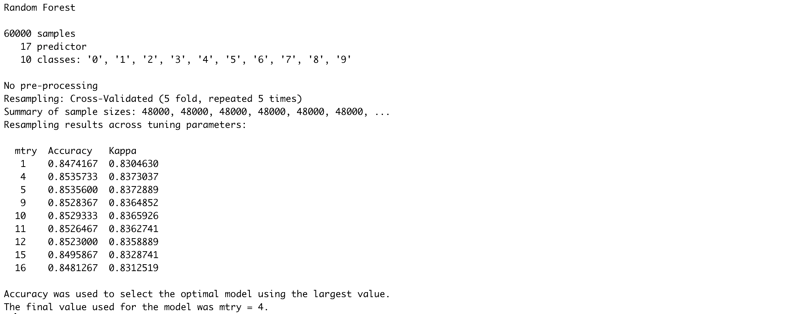

```{r, message = FALSE, error = FALSE, warning = FALSE, eval = FALSE}
plot(rf_rand)
```

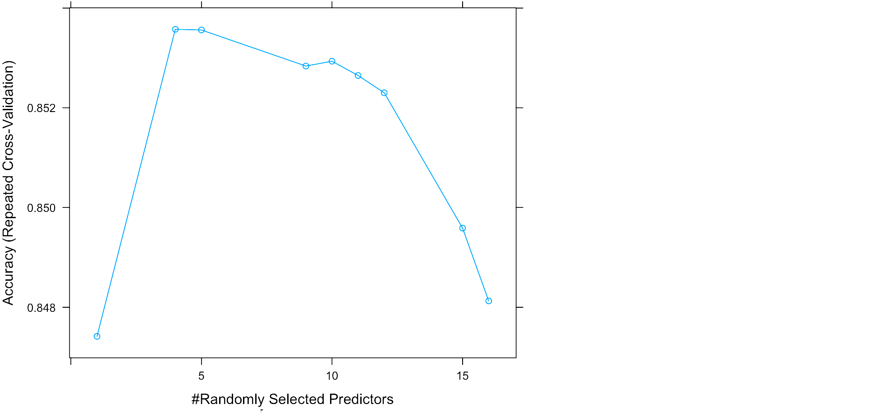

```{r, eval = FALSE}
mp.rf.rand = model_performance(rf_rand, train.images.pca, test.images.pca, 
                               train.data.pca$label, test.data.pca$label, "random_forest_random")
```


We can also use the `caret` framework to perform a grid search with pre-specified values for `mtry` rather than a random search as above.

```{r, message = FALSE, error = FALSE, warning = FALSE, eval = FALSE}
rf_grid_control = trainControl(method = "repeatedcv", 
                             search = "grid", 
                             number = 5, 
                             repeats = 5, 
                             allowParallel = TRUE, 
                             savePredictions = TRUE)
set.seed(1234)
rf_grid = train(x = train.images.pca, 
                 y = train.data.pca$label,
                 method = "rf", 
                 ntree = 200,
                 metric = "Accuracy", 
                 trControl = rf_grid_control,
                 tuneGrid = expand.grid(.mtry = c(1:pca.dims)))
```

```{r, message = FALSE, error = FALSE, warning = FALSE, eval = FALSE}
print(rf_grid)
```

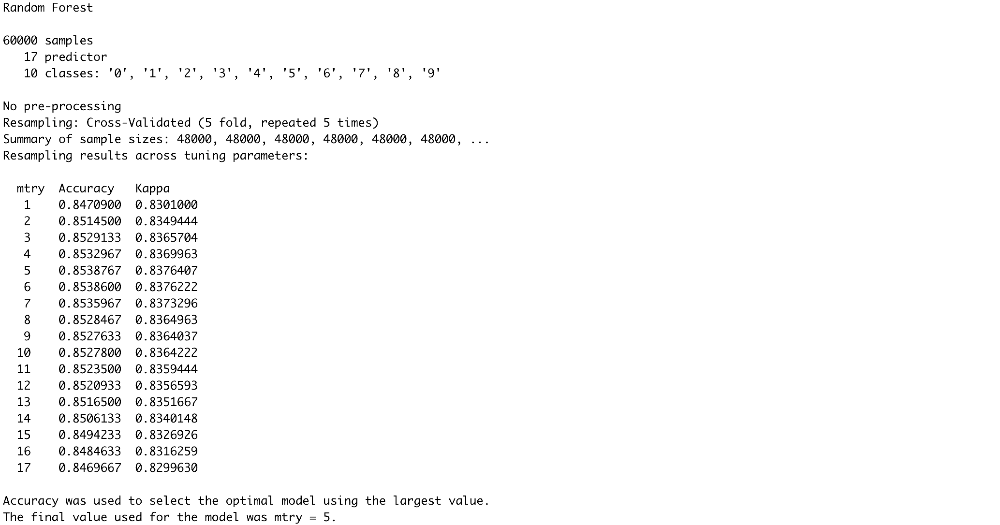

```{r, message = FALSE, error = FALSE, warning = FALSE, eval = FALSE}
plot(rf_grid)
```

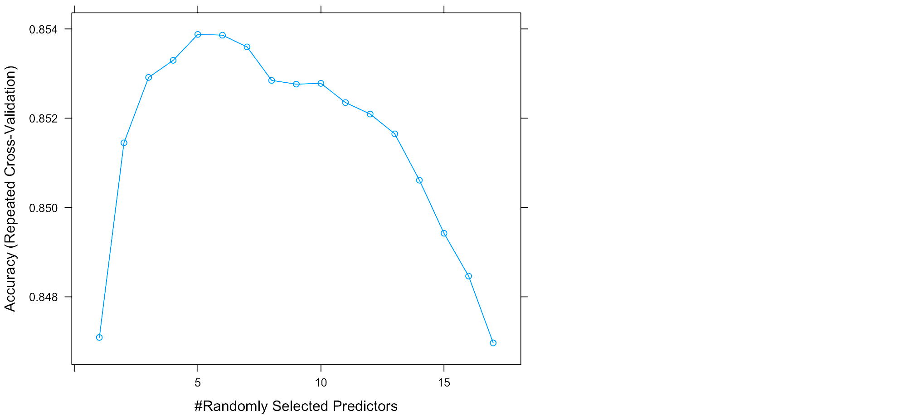

```{r, eval = FALSE}
mp.rf.grid = model_performance(rf_grid, train.images.pca, test.images.pca, 
                               train.data.pca$label, test.data.pca$label, "random_forest_grid")
```

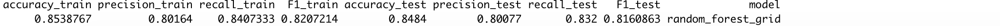

As shown by the results, the random search selects `mtry=4` as the optimal parameter, resulting in 85% training and 85% test accuracies. The grid search selects `mtry=5` and achieves similar accuracies for both values of 4 and 5 for `mtry`. We can see from the plots that according to `rf_rand`, `mtry` values of 4 and 5 lead to very similar results, which also goes for `mtry` values of 5 and 6 for `rf_grid`. Although the results of `rf_rand` and `rf_grid` are very similar, we choose the best model on the basis of accuracy and save this in `rf_best`. For this model, we'll look at the relationship between the error and random forest size as well as the receiver operating characteristic (ROC) curves for every class. Let's start by subtracting the best performing model from `rf_rand` and `rf_grid`.

```{r, eval = FALSE}
rf_models = list(rf_rand$finalModel, rf_grid$finalModel)
rf_accs = unlist(lapply(rf_models, function(x){ sum(diag(x$confusion)) / sum(x$confusion) }))
rf_best = rf_models[[which.max(rf_accs)]]
```

Next, we plot the relationship between the size of the random forest and the error using the `plot()` function from the `randomForest` package.
```{r, eval = FALSE}
library(randomForest)
plot(rf_best, main = "Relation between error and random forest size")
```

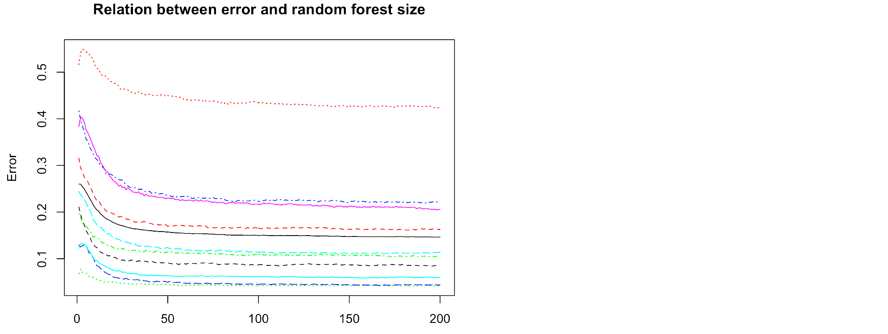

We observe from this plot that the error does not decrease anymore for any of the classes after about 100 trees, and so we can conclude that our forest size of 200 is sufficient. We can also plot the relative importance of the principal components for the model using the `varImpPlot()` function from the `randomForest` package.

```{r, eval = FALSE}
varImpPlot(rf_best)
```

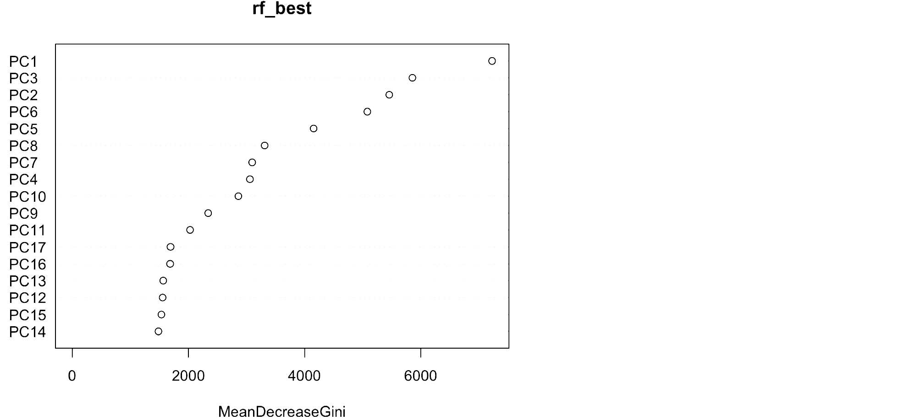

The resulting plot shows that the first, third and second principal components result in nodes with the highest purity and should therefore be used for further analyses, if desired. We can also plot the confusion matrix to make it easier to interpret the results and understand which categories the model finds easiest or most difficult to predict correctly. 

```{r, message = FALSE, error = FALSE, warning = FALSE, eval = FALSE}
library(reshape2)
pred = predict(rf_best, test.images.pca, type = "class")
conf = table(true = cloth_cats[as.numeric(test.data.pca$label)], 
              pred = cloth_cats[as.numeric(pred)])
conf = data.frame(conf / rowSums(conf))
```

```{r, message = FALSE, error = FALSE, warning = FALSE, eval = FALSE}
ggplot() + 
  geom_tile(data = conf, aes(x = true, y = pred, fill = Freq)) + 
  labs(x = "Actual", y = "Predicted", fill = "Proportion") +
  my_theme() +
  scale_fill_continuous(breaks = seq(0, 1, 0.25)) +
  theme(axis.text.x = element_text(angle = 90, hjust = 1)) + 
  coord_fixed()
```

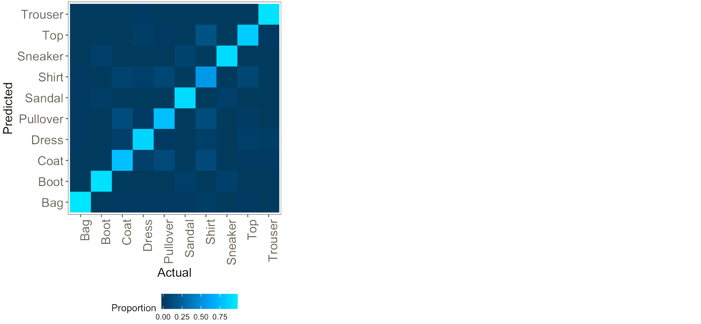

We observe from this plot that most of the classes are predicted accurately as the light blue (high percentages of correct predictions) are on the diagonal of the tile plot. We can also observe that the categories that are most often mixed up include shirts, tops, pullovers and coats, which makes sense because these are all mostly upper body clothing parts having similar shapes. The model predicts trousers, bags, boots and sneakers well, given that these rows and columns are particularly dark except for the diagonal element.

Finally, we plot the ROC curves for every class. The area underneath this curve is the proportion of correct classifications for that particular class, so the further the curve is "drawn" towards the top left from the 45 degrees line, the better the classification for that class. On the x-axis of an ROC plot, we usually have the false positive rate (false positive / (true negative + false positive)) and on the y-axis the true positive rate (true positive / (true positive + false negative)). Essentially, the ROC plot helps us to compare the performance of our model with respect to predicting different classes. We first need to obtain the data for the ROC curve for every class (or clothing category) in our data, which we all bind together by rows, including a label for the classes.

```{r, message = FALSE, error = FALSE, warning = FALSE, eval = FALSE}
library(ROCR)
library(plyr)
pred_roc = predict(rf_best, test.images.pca, type = "prob")
classes = unique(test.data.pca$label)
classes = classes[order(classes)]
plot_list = list()
for (i in 1:length(classes)) { 
  actual = ifelse(test.data.pca$label == classes[i], 1, 0)
  pred = prediction(pred_roc[, i], actual)
  perf = performance(pred, "tpr", "fpr")
  plot_list[[i]] = data.frame(matrix(NA, nrow = length(perf@x.values[[1]]), ncol = 2))
  plot_list[[i]]['x'] = perf@x.values[[1]]
  plot_list[[i]]['y'] = perf@y.values[[1]]
}
plotdf = rbind.fill(plot_list)
plotdf["Class"] = rep(cloth_cats, unlist(lapply(plot_list, nrow)))
```

Next, we plot the ROC curves for every class.
```{r, eval = FALSE}
ggplot() +
  geom_line(data = plotdf, aes(x = x, y = y, color = Class)) + 
  labs(x = "False positive rate", y = "True negative rate", color = "Class") +
  ggtitle("ROC curve per class") + 
  theme(legend.position = c(0.85, 0.35)) +
  coord_fixed() + 
  my_theme()
```

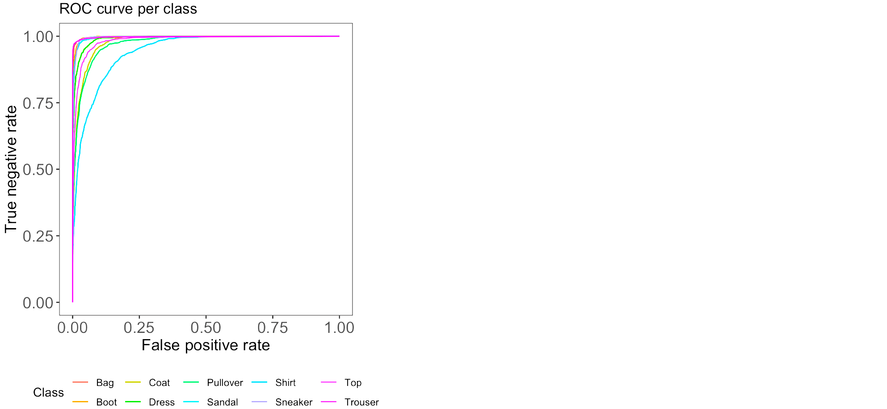

We observe from the ROC curves that shirts and pullovers are most often misclassified (as we saw before from the confusion matrix), whereas trousers, bags, boots and sneakers are most often correctly classified. This also corresponds to what we also observed from the plotted confusion matrix earlier. A possible explanation for this could be that shirts and pullovers can be very similar in shape to other categories, such as tops, coats and dresses; whereas bags, trousers, boots and sneakers are more dissimilar to other categories in the data.

## Gradient-Boosted Trees

While in random forests each tree is fully grown and trained independently with a random sample of data, in boosting every newly built tree incorporates the error from the previously built tree. That is, the trees are grown sequentially on an adapted version of the initial data, which does not require bootstrap sampling. Because of this, boosted trees are usually smaller and more shallow than the trees in random forests, improving the tree where it does not work well enough yet. Boosting is often said to outperform random forests, which is mainly because the approach learns slowly, which can be even further controlled by one of its parameters (i.e. shrinkage), which we'll tune later. Let's start with running a model where most of the parameters are at their default value.

In boosting, it's important to tune the parameters well and play around with different values of the parameters, which can easily be done using the `caret` framework. These parameters include the learning rate (`eta`), the minimal required loss reduction to further partition on a leaf node of the tree (`gamma`), the maximal depth of a tree (`max_depth`), the number of trees in the forest (`nrounds`), the minimum number of observsations in the trees' nodes (`min_child_weight`), the fraction of the training set observations randomly selected to grow trees (`subsample`) and the proportion of independent variables to use for each tree (`colsample_bytree`). An overview of all parameters can be found [here](https://xgboost.readthedocs.io/en/latest/parameter.html#parameters-for-tree-booster). Again, we use the `caret` framework to tune our boosting model. 

```{r, eval = FALSE}
xgb_control = trainControl(
  method = "cv",
  number = 5,
  classProbs = TRUE,
  allowParallel = TRUE,
  savePredictions = TRUE
)
```

Next, we define the possible combinations of the tuning parameters in the form of a grid, named `xgb_grid`.
```{r, eval = FALSE}
xgb_grid = expand.grid(
  nrounds = c(50, 100), 
  max_depth = seq(5, 15, 5),
  eta = c(0.002, 0.02, 0.2),
  gamma = c(0.1, 0.5, 1.0), 
  colsample_bytree = 1, 
  min_child_weight = c(1, 2, 3),
  subsample = c(0.5, 0.75, 1)
)
```

We set the seed and then train the model onto the transformed principal components of the training data using `xgb_control` and `xgb_grid` as specified earlier. Note that because of the relatively large number of tuning parameters, and thus the larger number of possible combinations of these parameters (`nrow(xgb_grid) = 486`), this may take quite a long time to run.
```{r, eval = FALSE}
set.seed(1234)
xgb_tune = train(x = train.images.pca, 
                 y = train.classes,
                 method = "xgbTree",
                 trControl = xgb_control,
                 tuneGrid = xgb_grid
)
xgb_tune
```


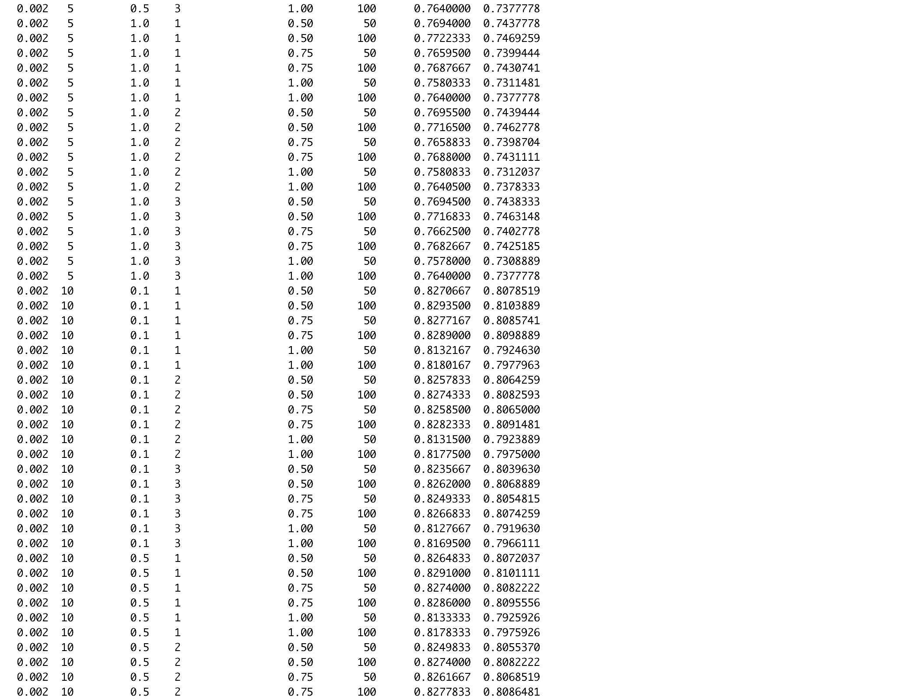
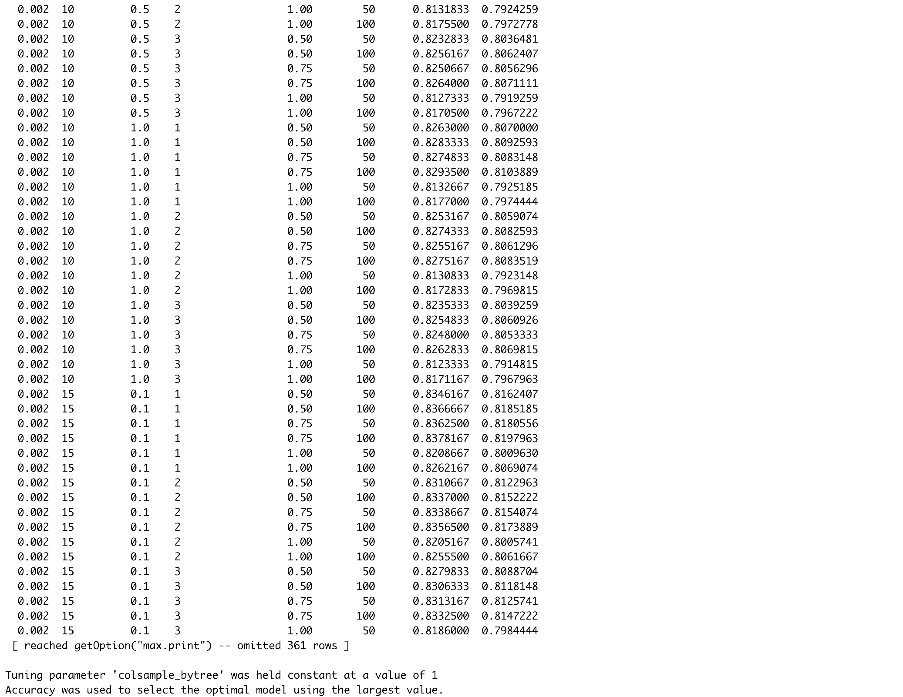
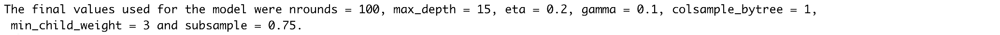

Let's have a look at the tuning parameters resulting in the highest accuracy, and the model performance overall. 
```{r, eval = FALSE}
xgb_tune$results[which.max(xgb_tune$results$Accuracy), ]
```


```{r, eval = FALSE}
mp.xgb = model_performance(xgb_tune, train.images.pca, test.images.pca, 
                           train.classes, test.classes, "xgboost")
```


The optimal combination of tuning parameter values resulted in 86.2% training and 85.5% testing accuracies. Although there may be some slight overfitting going on, the model performes a bit better than the random forest, as was expected. Let's have a look at the confusion matrix for the test set predictions to observe what clothing categories are mostly correctly or wrongly classified.

```{r, eval = FALSE}
table(pred = predict(xgb_tune, test.images.pca),
      true = test.classes)
```

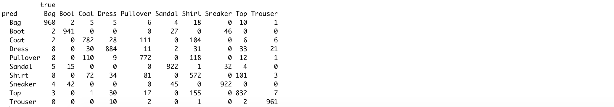

As we saw with the random forests, pullovers, shirts and coats are most often mixed up, while trousers, boots, bags and sneakers are most often correctly classified.

# Support Vector Machine

Support vector machines (SVMs) provide another method for classifying the clothing categories in the Fashion MNIST data. To better understand what SVMs entail, we'll have to go through some more complex explanations mainly summarizing James et. al. (2013), but please bear with me! The figure below might help you in understanding the different classifiers I will discuss in the next sections (figures taken from [here](https://slideplayer.com/slide/3266197/), [here](https://www.datasciencecentral.com/profiles/blogs/implementing-a-soft-margin-kernelized-support-vector-machine) and [here](https://www.exlservice.com/optimizing-healthcare-analytics-by-choosing-the-right-predictive-model)).


For an $n \times p$ data matrix and binary outcome variable $y_i \in \{-1, 1\}$, a hyperplane is a flat affine subspace of dimension $p - 1$ that divides the $p$-dimensional space into two halves, defined by $\beta_0 + \beta_1 X_1 + \dots + \beta_p X_p$. An observation in the test data is assigned an outcome class depending on the side of the perfectly separating hyperplane it lies, assuming that such a hyperplane exists. Cutoff $t$ for an observation's score $\hat{f}(X) = \hat{\beta}_1 X_1 + \hat{\beta}_2 X_2 + \dots + \hat{\beta}_p X_p$ determines which class it will be assigned to. The further an observation is located from the hyperplane at zero, the more confident the classifier is about the class assignment. If existent, an infinite number of separating hyperplanes can be constructed. A good option in this case would be to use the maximal margin classifier (MMC), which maximizes the margin around the midline of the widest strip that can be inserted between the two outcome classes. 

If a perfectly separating hyperplane does not exist, "almost separating" hyperplanes can be used by means of the support vector classifier (SVC). The SVC extends the MMC as it does not require classes to be separable by a linear boundary by including slack variables $\epsilon_i$ that allow some observations to be on the incorrect side of the margin or hyperplane. The extent to which incorrect placements are done is determined by tuning parameter cost $C \geq \sum_{i=1}^{n} \epsilon_i$, which thereby controls the bias-variance trade-off. The SVC is preferable over the MMC as it is more confident in class assignments due to the larger margins and ensures greater robustness as merely observations on the margin or violating the margin affect the hyperplane (James et al., 2013).

Both MMCs and SVCs assume a linear boundary between the two classes of the outcome variable. Non-linearity can be addressed by enlarging the feature space using functions of predictors. Support vector machines combine SVCs with non-linear Kernels $K(x_i, x_{i'})$ (e.g. radial, polynomial or sigmoid) to achieve efficient computations. Kernels are generalizations of inner products that quantify the similarity of two observations (James et al., 2013). Usually, the radial Kernel is selected for non-linear models as it provides a good default Kernel in the absence of prior knowledge of invariances regarding translations. The radial Kernel is defined as $K(x_i, x_{i'})= \exp{(-\sigma \sum_{j=1}^{p} (x_{ij} - x_{i'j})^2)}$, where $\sigma$ is a positive constant that makes the fit more non-linear as it increases. Tuning $C$ and $\sigma$ is necessary to find the optimal trade-off between reducing the number of training errors and making the decision boundary more irregular (by increasing C). As SVMs only require the computation of $\bigl(\begin{smallmatrix} n\\ 2 \end{smallmatrix}\bigr)$ Kernels for all distinct observation pairs, they greatly improve efficiency. 

SVMs can be extended to more than two classes using the one-versus-one-approach or the one-versus-all-approach. In case of $K$ classes, the former constructs $\bigl(\begin{smallmatrix} K\\ 2 \end{smallmatrix}\bigr)$ SVMs and assigns test observations to the class they were most frequently assigned to in these $\bigl(\begin{smallmatrix} K\\ 2 \end{smallmatrix}\bigr)$ classifiers. The latter fits $K$ SVMs and each time compares one of $K$ classes with the remaining $K − 1$ classes, assigning to each observation the class for which the confidence of being correct is highest.

As aforementioned, the parameters that need to be tuned are cost `C` and, in the case of a radial Kernel, non-linearity constant `sigma`. Let's start by tuning these parameters using a random search algorithm, again making use of the `caret` framework. We set the controls to perform 5-fold cross-validation and we use the `multiClassSummary()` function from the `MLmetrics` library to perform multi-class classification. We specify a radial Kernel, use accuracy as the performance metric and let the algorithm perform a random search for the cost parameter `C` over `pca.dims` (=17) random values. Note that the random search algorithm only searches for values of `C` while keeping a constant value for `sigma`. Note that contrarily to previous calls to `trainControl()`, we now set `classProbs = FALSE` because the base package used for estimating SVMs in `caret`, `kernlab`, leads to lower accuracies when specifying `classProbs = TRUE` due to using a secondary regression model (also check [this link for the Github issue](https://github.com/topepo/caret/issues/386)).

```{r, eval = FALSE}
library(MLmetrics)
svm_control = trainControl(method = "repeatedcv",   
                            number = 5,  
                            repeats = 5, 
                            classProbs = FALSE,
                            allowParallel = TRUE, 
                            summaryFunction = multiClassSummary,
                           savePredictions = TRUE)
```

```{r, eval = FALSE}
set.seed(1234)
svm_rand_radial = train(label ~ ., 
                data = cbind(train.images.pca, label = train.classes),
                method = "svmRadial", 
                trControl = svm_control, 
                tuneLength = pca.dims,
                metric = "Accuracy")
svm_rand_radial
```


```{r, eval = FALSE}
mp.svm.rand.radial = model_performance(svm_rand_radial, train.images.pca, test.images.pca, 
                                       train.classes, test.classes, "svm_random_radial")
```


The results show that the model is achieving relatively high accuracies of 88% and 87% on the training and test sets respectively, selecting `sigma = 0.040` and `C = 32` as the optimal parameters. Next, we repeat the above process but instead of a random search for the optimal parameters, we perform a grid search. As such, we can prespecify values to evaluate the model at, not only for `C` but also for `sigma`. We define the grid values in `svm_grid_radial`.

```{r, eval = FALSE}
svm_grid_radial = expand.grid(sigma = c(.01, 0.04, 0.1), C = c(0.01, 10, 32, 70, 150))
set.seed(1234)
svm_grid_radial = train(label ~ ., 
                              data = cbind(train.images.pca, label = train.classes),
                              method = "svmRadial", 
                              trControl = svm_control, 
                              tuneGrid = svm_grid_radial,
                              metric = "Accuracy")
svm_grid_radial
```


```{r, eval = FALSE}
mp.svm.grid.radial = model_performance(svm_grid_radial, train.images.pca, test.images.pca, 
                                       train.classes, test.classes, "svm_grid_radial")
```


The grid search selects the same optimal parameter values as the random search `C=32` and `sigma = 0.040`, therefore also resulting in 88% and 87% training and test accuracies. To get an idea on how `C` and `sigma` influence the training set accuracy, we plot the cross-validation accuracy as a function of `C`, with lines separated for each value of `sigma`.

```{r, eval = FALSE}
ggplot() + 
  my_theme() +
  geom_line(data = svm_grid_radial$results, aes(x = C, y = Accuracy, color = factor(sigma))) +
  geom_point(data = svm_grid_radial$results, aes(x = C, y = Accuracy, color = factor(sigma))) +
  labs(x = "Cost", y = "Cross-Validation Accuracy", color = "Sigma") +
  ggtitle('Relationship between cross-validation accuracy and values of cost and sigma')
```


The plot shows that the green line (`sigma = 0.04`) has the highest cross-validation accuracy for all values of `C` except for smaller values of `C` such as 0.01 and 10. Although the accuracy at `C=10` and `sigma = 0.1` (blue line) comes close, the highest overall accuracy achieved is for `C=32` and `sigma=32` (green line). Let's also have a look at the performance difference between using a radial and linear Kernel. Remember that for a linear Kernel, we only need to specify possible values for the cost parameter `C` and not `sigma` as there is no non-linearity.

```{r, eval = FALSE}
svm_grid_linear = expand.grid(C = c(1, 10, 32, 75, 150))
set.seed(1234)
svm_grid_linear = train(label ~ ., 
                              data = cbind(train.images.pca, label = train.classes),
                              method = "svmLinear", 
                              trControl = svm_control, 
                              tuneGrid = svm_grid_linear,
                              metric = "Accuracy")
svm_grid_linear
```


```{r, eval = FALSE}
mp.svm.grid.linear = model_performance(svm_grid_linear, train.images.pca, test.images.pca, 
                                       train.classes, test.classes, "svm_grid_linear")
```


Let's also compare the resampled accuracies of the SVMs with linear and radial Kernal specifications by means of a boxplot, which we can do because we set the same seed of 1234 before training both models.

```{r, eval = FALSE}
resamp_val = resamples(list(svm_radial = svm_grid_radial, svm_linear = svm_grid_linear))
plotdf = data.frame(Accuracy = c(resamp_val$values$`svm_radial~Accuracy`, resamp_val$values$`svm_linear~Accuracy`),
                    Model = rep(c("Radial Kernel", "Linear Kernel"), rep(nrow(resamp_val$values), 2)))
ggplot() +
  geom_boxplot(data = plotdf, aes(x = Model, y = Accuracy)) +
  ggtitle('Resample accuracy for SVM with linear and radial Kernel') + 
  my_theme()
```


Although the linear Kernel specification also selects `C=32` like the radial Kernel specification did, it performs worse than the radial Kernel specification with percentage point decreases of 6% on both the training and test set accuracies. Therefore, it looks like a non-linear model performs better on the Fashion MNIST data. 

# Wrapping Up

Finally, let's compare the performance from all models we've looked at, and also from the neural networks we developed in [the first blog post of this series](https://rviews.rstudio.com/2019/11/11/a-comparison-of-methods-for-predicting-clothing-classes-using-the-fashion-mnist-dataset-in-rstudio-and-python-part-1/). Let's have a look at how the models we estimated in this post performed:

```{r, eval = FALSE}
mp.df = rbind(mp.single.tree, mp.pruned.tree, mp.rf.rand, mp.rf.grid, mp.xgb, 
              mp.svm.rand.radial, mp.svm.grid.radial, mp.svm.grid.linear)
mp.df[order(mp.df$accuracy_test, decreasing = TRUE), ]
```


After taking measures to reduce overfitting, the convolutional neural network from the previous blog post achieved training and test set accuracies of 89.4% and 88.8% respectively. In this blog post, we have seen that a single tree performed quite terribly with a test set accuracy of 64.3%, and that tree pruning did not alter its performance in our case. The random and grid search for the best value of `mtry` in the random forests resulted in the selection of `mtry=5`, resulting in an 84.8% test set accuracy. The gradient-boosted decision trees performed slightly better than the random forest with a test set accuracy of 85.5%, also more often misclassifying pullovers, shirts and coats while correctly classifying trousers, boots, bags and sneakers. The best performing model of those we have seen today is the support vector machine with radial Kernel specification with tuning parameter values of `C=32` and `sigma=0.040`: this model achieved 86.9% test set accuracy. The same model with a linear Kernel, keeping `C=32`, performed less well with a test set accuracy of only 80.9%. Although achieving very similar results, none of the models estimated today beats the convolutional neural network from [the first blog post of this series](https://rviews.rstudio.com/2019/11/11/a-comparison-of-methods-for-predicting-clothing-classes-using-the-fashion-mnist-dataset-in-rstudio-and-python-part-1/), neither in performance nor computational time and feasibility.

# References 

James, G., Witten, D., Hastie, T., & Tibshirani, R. (2013). An introduction to statistical learning (Vol. 112, p. 18). New York: Springer.
