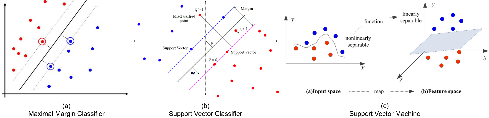
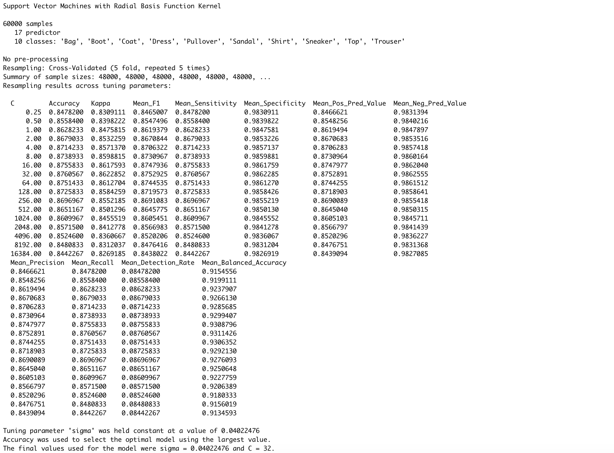
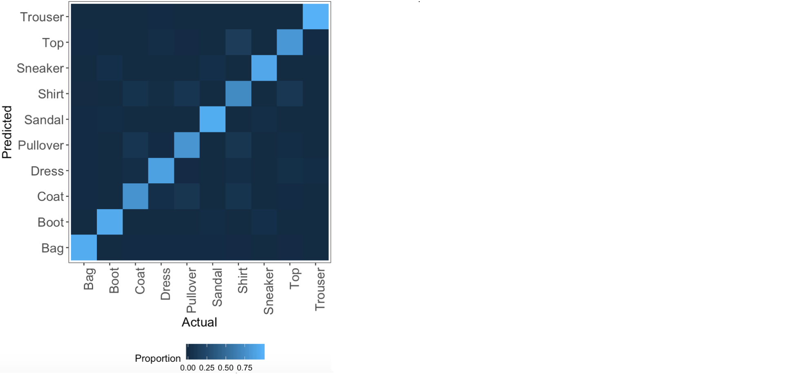
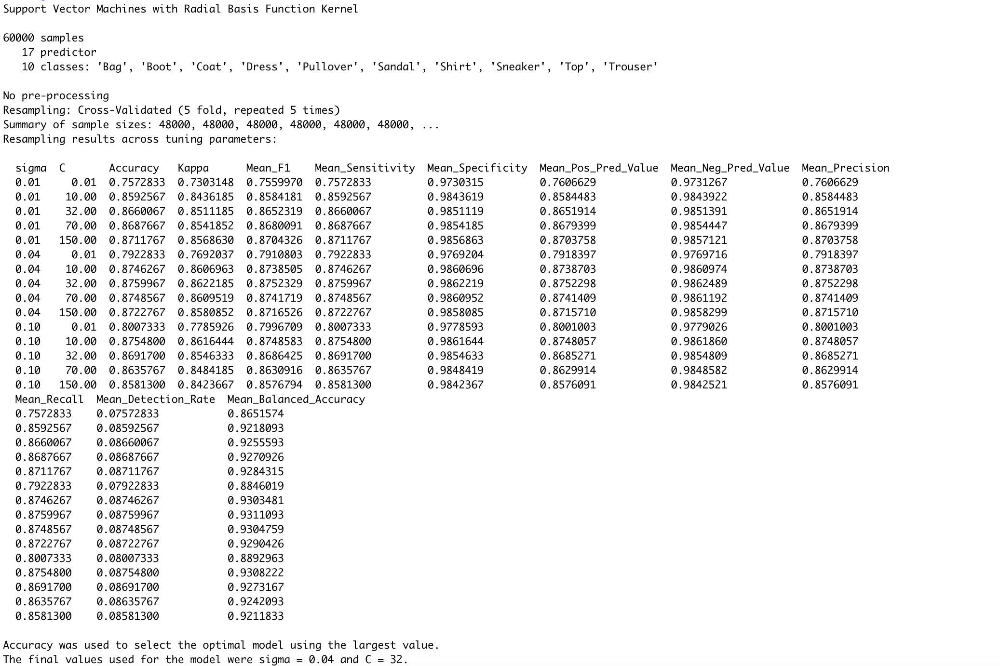
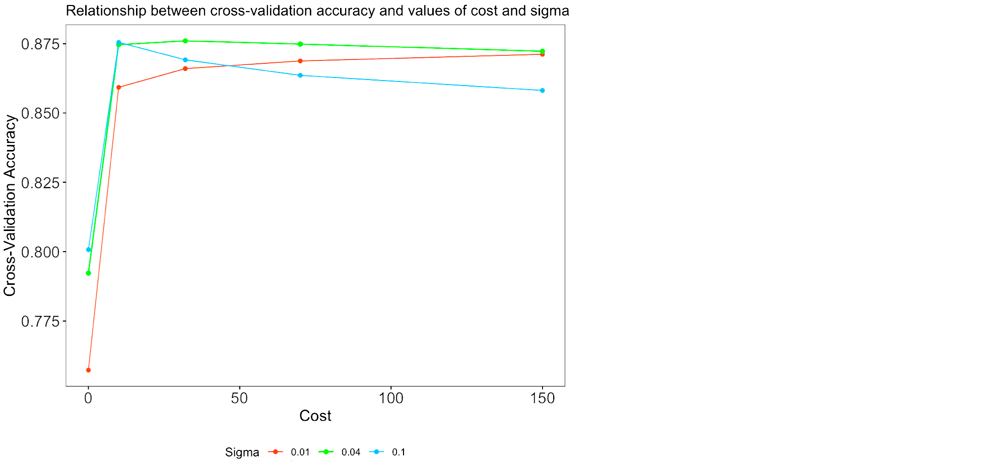
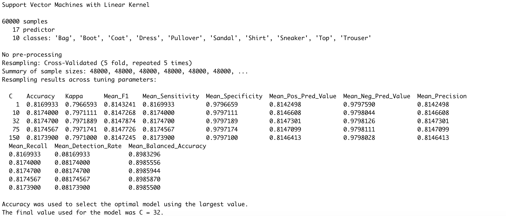
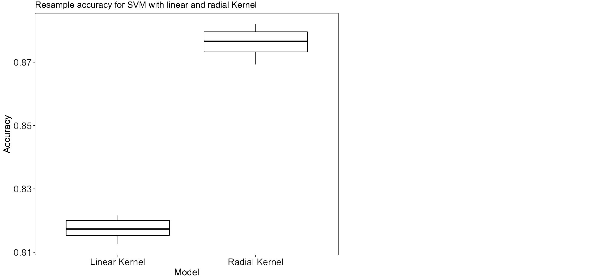
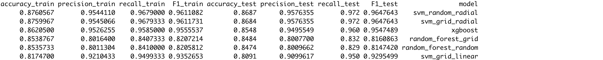

In this series of blog posts, I will compare different machine and deep learning methods to predict clothing categories from images using the Fashion MNIST data by Zalando. In [the first blog post of this series](https://rviews.rstudio.com/2019/11/11/a-comparison-of-methods-for-predicting-clothing-classes-using-the-fashion-mnist-dataset-in-rstudio-and-python-part-1/), we explored and prepared the data for analysis and learned how to predict the clothing categories of the Fashion MNIST data using my go-to model: an artificial neural network in Python. In [the second blog post](https://rviews.rstudio.com/2019/11/11/a-comparison-of-methods-for-predicting-clothing-classes-using-the-fashion-mnist-dataset-in-rstudio-and-python-part-2/), we used principal components analysis to reduce the data dimensionality and wrote a function to assess the performance of the models we will estimate in this post, namely tree-based methods (random forests and gradient-boosted trees). We saw in [the third blog post](https://rviews.rstudio.com/2019/11/11/a-comparison-of-methods-for-predicting-clothing-classes-using-the-fashion-mnist-dataset-in-rstudio-and-python-part-3/) that gradient-boosted trees and random forests achieve relatively high accuracy on dimensionality reduced data compared to the neural network from [the first blog post of this series](https://rviews.rstudio.com/2019/11/11/a-comparison-of-methods-for-predicting-clothing-classes-using-the-fashion-mnist-dataset-in-rstudio-and-python-part-1/). In this final blog post of the series, I will show you how to estimate support vector machines, compare the results from all models we've seen in this series of posts and wrap everything up. The R code for this post can be found on my [Github](https://github.com/fverkroost/RStudio-Blogs/blob/master/machine_learning_fashion_mnist_post234.R). Note that the data used in this post is based on the data preparation and principal components analysis from [the second blog post of this series](https://rviews.rstudio.com/2019/11/11/a-comparison-of-methods-for-predicting-clothing-classes-using-the-fashion-mnist-dataset-in-rstudio-and-python-part-2/).


```{r setup, message = FALSE, warning = FALSE, results = 'hide', echo = FALSE}
knitr::opts_chunk$set(echo = TRUE)
```

```{r, message = FALSE, warning = FALSE, results = 'hide', echo = FALSE}
library(devtools)
devtools::install_github("rstudio/keras")
library(keras)        
install_keras()  
fashion_mnist = keras::dataset_fashion_mnist()
library(magrittr)
c(train.images, train.labels) %<-% fashion_mnist$train
c(test.images, test.labels) %<-% fashion_mnist$test
train.images = data.frame(t(apply(train.images, 1, c))) / max(fashion_mnist$train$x)
test.images = data.frame(t(apply(test.images, 1, c))) / max(fashion_mnist$train$x)
pixs = ncol(fashion_mnist$train$x)
names(train.images) = names(test.images) = paste0('pixel', 1:(pixs^2))
train.labels = data.frame(label = factor(train.labels))
test.labels = data.frame(label = factor(test.labels))
train.data = cbind(train.labels, train.images)
test.data = cbind(test.labels, test.images)
cloth_cats = c('Top', 'Trouser', 'Pullover', 'Dress', 'Coat',  
                'Sandal', 'Shirt', 'Sneaker', 'Bag', 'Boot')
train.classes = factor(cloth_cats[as.numeric(as.character(train.labels$label)) + 1])
test.classes = factor(cloth_cats[as.numeric(as.character(test.labels$label)) + 1])
```


```{r, message = FALSE, warning = FALSE, echo = FALSE}
library(stats)
cov.train = cov(train.images)                      
pca.train = prcomp(cov.train)    
plotdf = data.frame(index = 1:(pixs^2), 
                    cumvar = summary(pca.train)$importance["Cumulative Proportion", ])
pca.dims = which(plotdf$cumvar >= .995)[1]
pca.rot = pca.train$rotation[, 1:pca.dims]  
train.images.pca = data.frame(as.matrix(train.images) %*% pca.rot)
test.images.pca  = data.frame(as.matrix(test.images) %*% pca.rot)
train.data.pca = cbind(train.images.pca, label = factor(train.data$label))
test.data.pca = cbind(test.images.pca, label = factor(test.data$label))
```


```{r, message = FALSE, warning = FALSE, echo = FALSE}
model_performance = function(fit, trainX, testX, trainY, testY, model_name){
  
  # Predictions on train and test data for different types of models
  if (any(class(fit) == "rpart")){
    
    library(rpart)
    pred_train = predict(fit, newdata = trainX, type = "class")
    pred_test = predict(fit, newdata = testX, type = "class")
    
  } else if (any(class(fit) == "train")){
    
    library(data.table)
    pred_dt = as.data.table(fit$pred[, names(fit$bestTune)]) 
    names(pred_dt) = names(fit$bestTune)
    index_list = lapply(1:ncol(fit$bestTune), function(x, DT, tune_opt){
      return(which(DT[, Reduce(`&`, lapply(.SD, `==`, tune_opt[, x])), .SDcols = names(tune_opt)[x]]))
    }, pred_dt, fit$bestTune)
    rows = Reduce(intersect, index_list)
    pred_train = fit$pred$pred[rows]
    pred_test = predict(fit, newdata = testX)
    trainY = fit$pred$obs[rows]
    
  } else {
    
    print(paste0("Error: Function evaluation unknown for object of type ", class(fit)))
    break
    
  }
  
  # Performance metrics on train and test data
  library(MLmetrics)
  df = data.frame(accuracy_train = Accuracy(trainY, pred_train),
                  precision_train = Precision(trainY, pred_train),
                  recall_train = Recall(trainY, pred_train),
                  F1_train = F1_Score(trainY, pred_train), 
                  accuracy_test = Accuracy(testY, pred_test),
                  precision_test = Precision(testY, pred_test),
                  recall_test = Recall(testY, pred_test),
                  F1_test = F1_Score(testY, pred_test),
                  model = model_name)
  
  print(df)
  
  return(df)
}
```

# Support Vector Machine

Support vector machines (SVMs) provide another method for classifying the clothing categories in the Fashion MNIST data. To better understand what SVMs entail, we'll have to go through some more complex explanations mainly summarizing James et. al. (2013), but please bear with me! The figure below might help you in understanding the different classifiers I will discuss in the next sections (figures taken from [here](https://slideplayer.com/slide/3266197/), [here](https://www.datasciencecentral.com/profiles/blogs/implementing-a-soft-margin-kernelized-support-vector-machine) and [here](https://www.exlservice.com/optimizing-healthcare-analytics-by-choosing-the-right-predictive-model)).



For an $n \times p$ data matrix and binary outcome variable $y_i \in \{-1, 1\}$, a hyperplane is a flat affine subspace of dimension $p - 1$ that divides the $p$-dimensional space into two halves, defined by $\beta_0 + \beta_1 X_1 + \dots + \beta_p X_p$. An observation in the test data is assigned an outcome class depending on the side of the perfectly separating hyperplane it lies, assuming that such a hyperplane exists. Cutoff $t$ for an observation's score $\hat{f}(X) = \hat{\beta}_1 X_1 + \hat{\beta}_2 X_2 + \dots + \hat{\beta}_p X_p$ determines which class it will be assigned to. The further an observation is located from the hyperplane at zero, the more confident the classifier is about the class assignment. If existent, an infinite number of separating hyperplanes can be constructed. A good option in this case would be to use the maximal margin classifier (MMC), which maximizes the margin around the midline of the widest strip that can be inserted between the two outcome classes. 

If a perfectly separating hyperplane does not exist, "almost separating" hyperplanes can be used by means of the support vector classifier (SVC). The SVC extends the MMC as it does not require classes to be separable by a linear boundary by including slack variables $\epsilon_i$ that allow some observations to be on the incorrect side of the margin or hyperplane. The extent to which incorrect placements are done is determined by tuning parameter cost $C \geq \sum_{i=1}^{n} \epsilon_i$, which thereby controls the bias-variance trade-off. The SVC is preferable over the MMC as it is more confident in class assignments due to the larger margins and ensures greater robustness as merely observations on the margin or violating the margin affect the hyperplane (James et al., 2013).

Both MMCs and SVCs assume a linear boundary between the two classes of the outcome variable. Non-linearity can be addressed by enlarging the feature space using functions of predictors. Support vector machines combine SVCs with non-linear Kernels $K(x_i, x_{i'})$ (e.g. radial, polynomial or sigmoid) to achieve efficient computations. Kernels are generalizations of inner products that quantify the similarity of two observations (James et al., 2013). Usually, the radial Kernel is selected for non-linear models as it provides a good default Kernel in the absence of prior knowledge of invariances regarding translations. The radial Kernel is defined as $K(x_i, x_{i'})= \exp{(-\sigma \sum_{j=1}^{p} (x_{ij} - x_{i'j})^2)}$, where $\sigma$ is a positive constant that makes the fit more non-linear as it increases. Tuning $C$ and $\sigma$ is necessary to find the optimal trade-off between reducing the number of training errors and making the decision boundary more irregular (by increasing C). As SVMs only require the computation of $\bigl(\begin{smallmatrix} n\\ 2 \end{smallmatrix}\bigr)$ Kernels for all distinct observation pairs, they greatly improve efficiency. 

SVMs can be extended to more than two classes using the one-versus-one-approach or the one-versus-all-approach. In case of $K$ classes, the former constructs $\bigl(\begin{smallmatrix} K\\ 2 \end{smallmatrix}\bigr)$ SVMs and assigns test observations to the class they were most frequently assigned to in these $\bigl(\begin{smallmatrix} K\\ 2 \end{smallmatrix}\bigr)$ classifiers. The latter fits $K$ SVMs and each time compares one of $K$ classes with the remaining $K − 1$ classes, assigning to each observation the class for which the confidence of being correct is highest.

As aforementioned, the parameters that need to be tuned are cost `C` and, in the case of a radial Kernel, non-linearity constant `sigma`. Let's start by tuning these parameters using a random search algorithm, again making use of the `caret` framework. We set the controls to perform 5-fold cross-validation and we use the `multiClassSummary()` function from the `MLmetrics` library to perform multi-class classification. We specify a radial Kernel, use accuracy as the performance metric and let the algorithm perform a random search for the cost parameter `C` over `pca.dims` (=17) random values. Note that the random search algorithm only searches for values of `C` while keeping a constant value for `sigma`. Note that contrarily to previous calls to `trainControl()`, we now set `classProbs = FALSE` because the base package used for estimating SVMs in `caret`, `kernlab`, leads to lower accuracies when specifying `classProbs = TRUE` due to using a secondary regression model (also check [this link for the Github issue](https://github.com/topepo/caret/issues/386)).

```{r, eval = FALSE}
library(MLmetrics)
svm_control = trainControl(method = "repeatedcv",   
                            number = 5,  
                            repeats = 5, 
                            classProbs = FALSE,
                            allowParallel = TRUE, 
                            summaryFunction = multiClassSummary,
                           savePredictions = TRUE)
```

```{r, eval = FALSE}
set.seed(1234)
svm_rand_radial = train(label ~ ., 
                data = cbind(train.images.pca, label = train.classes),
                method = "svmRadial", 
                trControl = svm_control, 
                tuneLength = pca.dims,
                metric = "Accuracy")
svm_rand_radial
```



```{r, eval = FALSE}
mp.svm.rand.radial = model_performance(svm_rand_radial, train.images.pca, test.images.pca, 
                                       train.classes, test.classes, "svm_random_radial")
```


The results show that the model is achieving relatively high accuracies of 88% and 87% on the training and test sets respectively, selecting `sigma = 0.040` and `C = 32` as the optimal parameters. Let's have a look at the confusion matrix to see what clothing categories are best and worst predicted by visualizing the confusion matrix. First, we compute the predictions for the training data as described when defining the `model_performance` function in [the second blog post](https://rviews.rstudio.com/2019/11/11/a-comparison-of-methods-for-predicting-clothing-classes-using-the-fashion-mnist-dataset-in-rstudio-and-python-part-2/).

```{r, eval = FALSE}
library(data.table)
pred_dt = as.data.table(svm_rand_radial$pred[, names(svm_rand_radial$bestTune)]) 
names(pred_dt) = names(svm_rand_radial$bestTune)
index_list = lapply(1:ncol(svm_rand_radial$bestTune), function(x, DT, tune_opt){
  return(which(DT[, Reduce(`&`, lapply(.SD, `==`, tune_opt[, x])), .SDcols = names(tune_opt)[x]]))
}, pred_dt, svm_rand_radial$bestTune)
rows = Reduce(intersect, index_list)
pred_train = svm_rand_radial$pred$pred[rows]
trainY = svm_rand_radial$pred$obs[rows]
conf = table(pred_train, trainY)
```

Next, we reshape the confusion matrix into a data frame with three columns: one for the true categories (`trainY`), one for the predicted categories (`pred_train`), and one for the proportion of correct predictions for the true category (`Freq`). We plot this as a tile plot with a blue color scale where lighter values indicate larger proportions of matches between a particular combination of true and predicted categories, and darker values indicate a small proportion of matches between them. Note that we use the custom plotting theme `my_theme()` as defined in the [the second blog post of this series](https://rviews.rstudio.com/2019/11/11/a-comparison-of-methods-for-predicting-clothing-classes-using-the-fashion-mnist-dataset-in-rstudio-and-python-part-2/).

```{r, eval = FALSE}
conf = data.frame(conf / rowSums(conf))
ggplot() + 
  geom_tile(data = conf, aes(x = trainY, y = pred_train, fill = Freq)) + 
  labs(x = "Actual", y = "Predicted", fill = "Proportion") +
  my_theme() +
  theme(axis.text.x = element_text(angle = 90, hjust = 1)) + 
   scale_fill_continuous(breaks = seq(0, 1, 0.25)) +
  coord_fixed()
```



We observe from this plot that most of the classes are predicted accurately as the light blue (high percentages of correct predictions) are on the diagonal of the tile plot. We can also observe that the categories that are most often mixed up include shirts, tops, pullovers and coats, which makes sense because these are all mostly upper body clothing parts having similar shapes. The model predicts trousers, bags, boots and sneakers well, given that these rows and columns are particularly dark except for the diagonal element. These results are in agreement with those from the random forest and gradient-boosted trees from [the previous blog post of this series](https://rviews.rstudio.com/2019/11/11/a-comparison-of-methods-for-predicting-clothing-classes-using-the-fashion-mnist-dataset-in-rstudio-and-python-part-3/).

Next, we repeat the above process for fitting a support vector machine but instead of a random search for the optimal parameters, we perform a grid search. As such, we can prespecify values to evaluate the model at, not only for `C` but also for `sigma`. We define the grid values in `svm_grid_radial`.

```{r, eval = FALSE}
svm_grid_radial = expand.grid(sigma = c(.01, 0.04, 0.1), C = c(0.01, 10, 32, 70, 150))
set.seed(1234)
svm_grid_radial = train(label ~ ., 
                              data = cbind(train.images.pca, label = train.classes),
                              method = "svmRadial", 
                              trControl = svm_control, 
                              tuneGrid = svm_grid_radial,
                              metric = "Accuracy")
svm_grid_radial
```



```{r, eval = FALSE}
mp.svm.grid.radial = model_performance(svm_grid_radial, train.images.pca, test.images.pca, 
                                       train.classes, test.classes, "svm_grid_radial")
```


The grid search selects the same optimal parameter values as the random search (`C=32` and `sigma = 0.040`), therefore also resulting in 88% and 87% training and test accuracies. To get an idea on how `C` and `sigma` influence the training set accuracy, we plot the cross-validation accuracy as a function of `C`, with lines separated for each value of `sigma`.

```{r, eval = FALSE}
ggplot() + 
  my_theme() +
  geom_line(data = svm_grid_radial$results, aes(x = C, y = Accuracy, color = factor(sigma))) +
  geom_point(data = svm_grid_radial$results, aes(x = C, y = Accuracy, color = factor(sigma))) +
  labs(x = "Cost", y = "Cross-Validation Accuracy", color = "Sigma") +
  ggtitle('Relationship between cross-validation accuracy and values of cost and sigma')
```



The plot shows that the green line (`sigma = 0.04`) has the highest cross-validation accuracy for all values of `C` except for smaller values of `C` such as 0.01 and 10. Although the accuracy at `C=10` and `sigma = 0.1` (blue line) comes close, the highest overall accuracy achieved is for `C=32` and `sigma=32` (green line). Let's also have a look at the performance difference between using a radial and linear Kernel. Remember that for a linear Kernel, we only need to specify possible values for the cost parameter `C` and not `sigma` as there is no non-linearity.

```{r, eval = FALSE}
svm_grid_linear = expand.grid(C = c(1, 10, 32, 75, 150))
set.seed(1234)
svm_grid_linear = train(label ~ ., 
                              data = cbind(train.images.pca, label = train.classes),
                              method = "svmLinear", 
                              trControl = svm_control, 
                              tuneGrid = svm_grid_linear,
                              metric = "Accuracy")
svm_grid_linear
```



```{r, eval = FALSE}
mp.svm.grid.linear = model_performance(svm_grid_linear, train.images.pca, test.images.pca, 
                                       train.classes, test.classes, "svm_grid_linear")
```


We can also visually compare the resampled accuracies of the SVMs with linear and radial Kernal specifications by means of a boxplot, which we can do because we set the same seed of 1234 before training both models.

```{r, eval = FALSE}
resamp_val = resamples(list(svm_radial = svm_grid_radial, svm_linear = svm_grid_linear))
plotdf = data.frame(Accuracy = c(resamp_val$values$`svm_radial~Accuracy`, resamp_val$values$`svm_linear~Accuracy`),
                    Model = rep(c("Radial Kernel", "Linear Kernel"), rep(nrow(resamp_val$values), 2)))
ggplot() +
  geom_boxplot(data = plotdf, aes(x = Model, y = Accuracy)) +
  ggtitle('Resample accuracy for SVM with linear and radial Kernel') + 
  my_theme()
```



Although the linear Kernel specification also selects `C=32` like the radial Kernel specification did, it performs worse than the radial Kernel specification with percentage point decreases of 6% on both the training and test set accuracies. Therefore, it looks like a non-linear model performs better on classifying the Fashion MNIST data. 

# Wrapping Up

Finally, let's compare the performance from all models we've looked at, and also from the neural networks we developed in [the first blog post of this series](https://rviews.rstudio.com/2019/11/11/a-comparison-of-methods-for-predicting-clothing-classes-using-the-fashion-mnist-dataset-in-rstudio-and-python-part-1/). Let's have a look at how the models we estimated in this post performed:

```{r, eval = FALSE}
mp.df = rbind(mp.rf.rand, mp.rf.grid, mp.xgb, mp.svm.rand.radial, mp.svm.grid.radial, mp.svm.grid.linear)
mp.df[order(mp.df$accuracy_test, decreasing = TRUE), ]
```



After taking measures to reduce overfitting, the convolutional neural network from the previous blog post achieved training and test set accuracies of 89.4% and 88.8% respectively. The random and grid search for the best value of `mtry` in the random forests resulted in the selection of `mtry=5`, resulting in an 84.8% test set accuracy. The gradient-boosted decision trees performed slightly better than the random forest with a test set accuracy of 85.5%. Both tree-based models more often misclassified pullovers, shirts and coats, while correctly classifying trousers, boots, bags and sneakers. Both tree-based methods are however outperformed by the support vector machine with radial Kernel specification with tuning parameter values of `C=32` and `sigma=0.040`: this model achieved 86.9% test set accuracy. The same model with a linear Kernel, keeping `C=32`, performed less well with a test set accuracy of only 80.9%. None of the models estimated beats the convolutional neural network from [the first blog post of this series](https://rviews.rstudio.com/2019/11/11/a-comparison-of-methods-for-predicting-clothing-classes-using-the-fashion-mnist-dataset-in-rstudio-and-python-part-1/), neither in performance nor computational time and feasibility. However, the differences in test set performance are only small: the convolutional neural network achieved 88.8% test set accuracy, compared to 86.9% test set accuracy achieved by the support vector machine with radial Kernel. This shows that we do not always need to resort to deep learning to obtain high accuracies, but that we can also perform image classification to a reasonable standard using basic machine learning models with dimensionality-reduced data.

# References 

James, G., Witten, D., Hastie, T., & Tibshirani, R. (2013). An introduction to statistical learning (Vol. 112, p. 18). New York: Springer.

